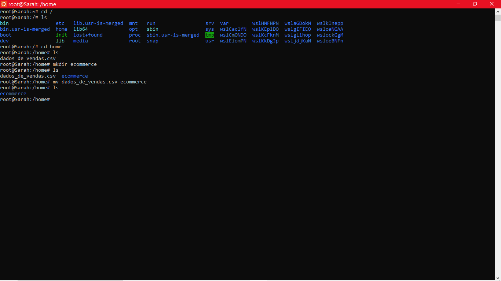
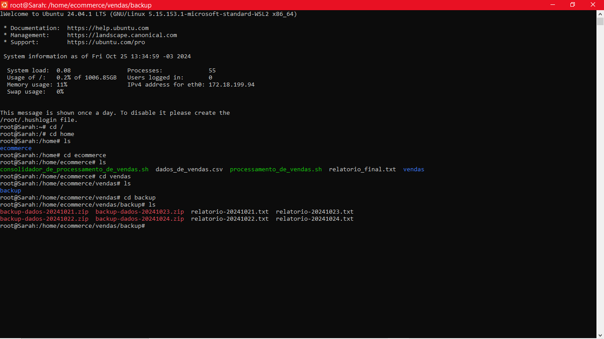

### ETAPA 1 - Fundamentos de Linux 
Iniciei o desafio da **Sprint 1** pela compreensão da situação problema proposta.  Minha squad nos primeiros dias se dedicou a que todos da equipe conseguissem  iniciar o desafio e, como síntese da discussão em grupo, elaborei um pseudocódigo em linhagem natural conforme imagem abaixo. 

Em seguida, fiz a preparação do ambiente para realização do desafio, conforme imagem abaixo.  

Concluída a preparação, debrucei-me na escrita do **Script 1** "processamento_de_vendas.sh" que geraria os arquivos para os relatórios de vendas.  - A princípio decidi usar os comando ensinados no curso para abrir, gerar, copiar, renomear e mover os diretórios e arquivos. Tais como: `cd`, `mkdir`,`cp`,`mv`;

- Para nomear os arquivos com a data usei o comando `date`;

- Para gerar os elementos que compoem o relatório criei com o comando `touch` três arquivos txt temporários chamados **data1**, **dataf** e **itens** e concatenei no arquivo do relatório do dia com o comando `cat`. Com o comando `echo` inseri a data e hora no arquivo, assim como o número de produtos que foi calculado pelo comando `head`.

 - Após a primeira execução, acrescentei uma estrutura de decisão ao código, devido ao não processamento do agendamento no segundo dia no horário das 15:27.  Que suponho que deve ter ocorrido pois os diretórios vendas e backup já estavam criados e geraram esse bug. Com a estrutura `if` `else` e `[ -d /vendas/ ]` foi possível identificar que esses diretórios existiam e prosseguir com a execução nos demais dias.

 - Dessa forma, foi necessário reagendar o script para outro horário no mesmo dia.  Logo após o processamento, reajustei o horário do agendamento no terminal. 

O código do **Script 1** pode ser conferido em [Script 1](../Evidencias/processamento_de_vendas.sh)

Para agendamento no terminal, foi usado o comando *crontab -e* conforme imagem a abaixo.

Após os quatro dias de agendamento, elaborei o **Script 2** disponivel em [Script 2](../Evidencias/consolidador_de_processamento_de_vendas.sh) que concatena todos os relatórios e finalizei o desafio.  

Os arquivos gerados (relatórios, csv's, códigos e imagens) podem ser acessados em [Evidencias](../Evidencias/).  A imagem a seguir mostra via terminal o que foi gerado como "entregaveis".

OBS: Apesar de agendar o **Script 1** para as 15:27 como pedido, apenas no dia 23/10/2024  o arquivo foi gerado nesse horário e não consegui identificar motivo do *delay* nos dias 21 e 24/10 já que o crontab aparecia ativo (ao consultar via terminal com o comando `sudo service cron status`). 