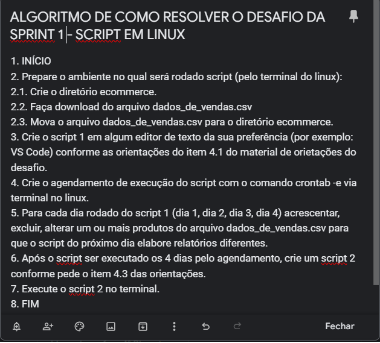
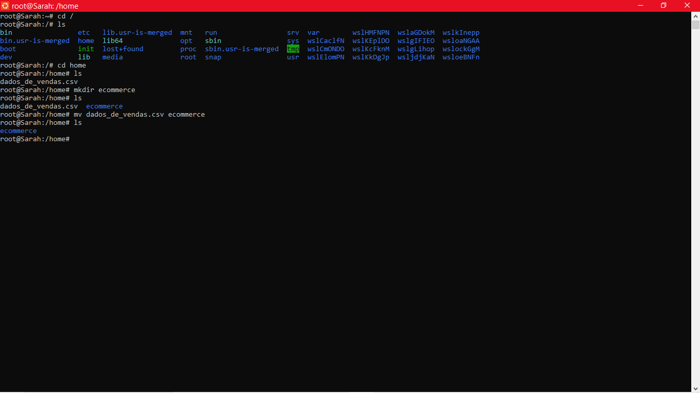
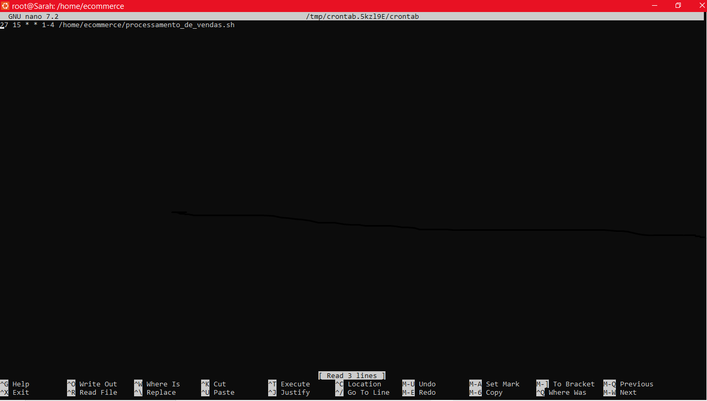
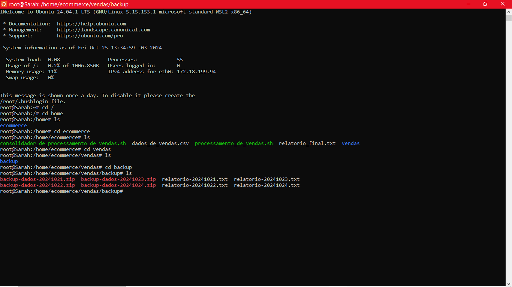

# Resumo

**Git Hub:** Aprendi a utilizar o Git e GitHub de modo correto no dia a dia. Os conteúdos abordaram o gerenciamento de repositórios locais e em servidores externos, criar um portfólio com o GitHubPages, comandos básicos e avançados em Git para criar e compartilhar Gits, documentação em Markdown e também fluxo de controle de versionamento de um projeto. 

**Linux:** Pude entender como funciona o sistema operacional Linux, assim como instalar a distribuição Ubuntu e seus principais conceitos. Aprendi comandos e técnicas de terminal; gerenciamento de usuários; grupos e permissões de arquivos e diretórios; gerenciamento de aplicações e pacotes; gerenciamento de redes; e a utilizar editores de texto como Vim e Nano.   

# Evidências

### ETAPA 1 - Fundamentos de Linux 
Iniciei o desafio da **Sprint 1** pela compreensão da situação problema proposta. Minha squad nos primeiros dias se dedicou a que todos da equipe conseguissem iniciar o desafio e, como síntese da discussão em grupo, elaborei um pseudocódigo em linhagem natural conforme imagem abaixo. 

Em seguida, fiz a preparação do ambiente para realização do desafio, conforme imagem abaixo.

Concluída a preparação, debrucei-me na escrita do **Script 1** "processamento_de_vendas.sh" que geraria os arquivos para o relatório de vendas. A princípio decidi usar os comando ensinados no curso para gerar os diretórios. Após a execução, acrescentei uma estrutura de decisão ao código, devido ao não processamento do agendamento no segundo dia no horário das 15:27. Dessa forma, foi necessário reagendar o script para outro horário no mesmo dia. Logo após o processamento, reajustei o horário do agendamento no terminal. 
O código do **Script 1** pode ser conferido em [Script 1](Desafio/etapa-1)
Para agendamento no terminal, foi usado o comando *crontab -e* conforme imagem a abaixo.

Após os quatro dias de agendamento, elaborei o **Script 2** disponivel em [Script 2](Desafio/etapa-1) e finalizei a primeira etapa do desafio. Os arquivos gerados (relatórios, csv's, códigos e imagens) podem ser acessador em [Desafio](Desafio/etapa-1). A imagem a seguir mostra via terminal o que foi gerado como "entregaveis".

OBS: Apesar de agendar o **Script 1** para as 15:27 como pedido, apenas no dia 23/10/2024 o arquivo foi gerado nesse horário e não consegui identificar motivo do *delay* nos dias 21 e 24/10 já que o crontab aparecia ativo (ao consultar via terminal). 