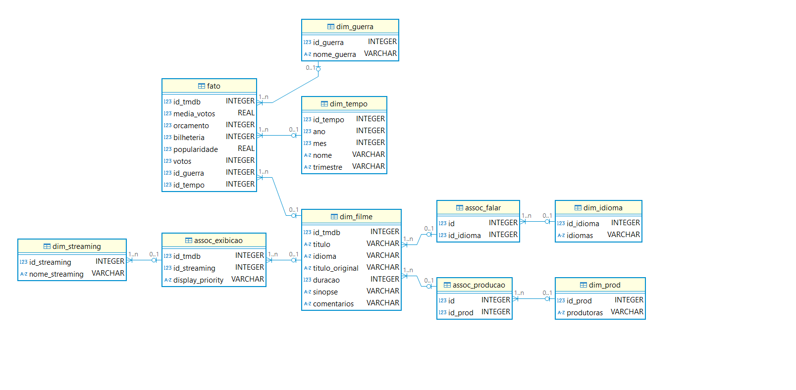
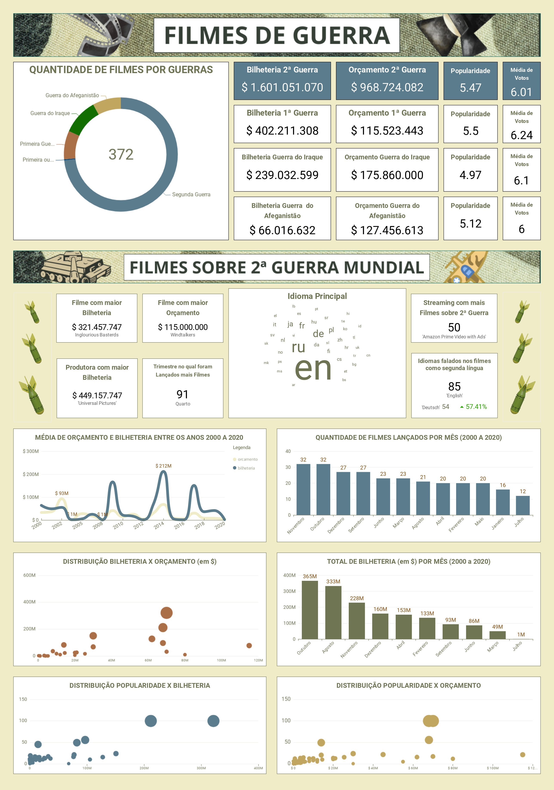

**INTRODUÇÃO**

Nesta etapa, foram extraídos insights sobre os dados da camada Refined, os quais foram apresentados usando o serviço de visualização da AWS chamado QuickSight. 

Retomando a análise apresentada no início desta jornada, estabeleci como hipótese inicial que: 

- **Há indícios de que o tema principal do gênero "guerra", nos últimos 20 anos, foi Segunda Guerra Mundial.**

Retomando o caminho percorrido durante o desafio:

1) Comecei por filtrar apenas os filmes que contêm o gênero guerra da API do TMDB e os inseri na camada RAW do Datalake;

2) Depois, padronizei os arquivos locais do TMDB em formato parquet, apliquei procedimentos de ELT para tratamento dos dados e os armazanei em uma segunda camada chamada de TRUSTED;

3) Por fim, na camada REFINED (que é a camada de consumo), apliquei o processo de ETL, selecionei uma amostra correspondente ao período de 2000 a 2020 e referenciei quatro guerras: Primeira Guerra Mundial, Segunda Guerra Mundial, Guerra do Iraque e Guerra do Afeganistão.

Ao final do processo de ETL na camada REFINED, a amostra continha 372 títulos de filmes. 

O modelo multidimensional a seguir representa as relações entre os dados:

OBS.: Após a correção técnica, foram feitos ajustes no modelo para corrigir a dimensão tempo, renomear as colunas e ajustar a classificação dos tipos de guerra dos filmes. O códido de refinamento pode ser acessado [aqui](../Desafio/refinamento.py).

**ENTREGA 5 - CONSUMO DE DADOS**

Com base nesse modelo multidimensional, elaborei a seguinte visualização no Quicksight:

Analisando o primeiro conjunto de dados do dashboard, é possível conferir que a hipótese inicial é válida. O tema Segunda Guerra Mundial corresponde a 273 filmes do total da amostra (73%), possui um bom resultado de bilheteria (aproximadamente $1,6 bilhões), registra um relevante orçamento (aproximadamente $968 milhões) e alcança popularidade e média de votos moderadas no TMDB. As outras guerras, por sua vez, apresentam indicadores mais modestos.

Afunilando a análise para o conjunto de filmes sobre a Segunda Guerra Mundial, no quadro de indicadores, podemos responder da seguinte forma às perguntas elaboradas na Sprint 6:

**- Qual é a distribuição dos orçamentos dos filmes sobre a Segunda Guerra Mundial ao longo dos anos 2000 a 2020? Como isso se relaciona com as bilheterias?**

Os investimentos se concentram no intervalo de $20 a $50 mihões e um grupo menor de filmes no intervalo de $60 a $80 milhões, enquanto que as bilheterias retornam de geralmente por volta de $200 milhões. Os gráficos de distribuição indicam portanto que, apesar do alto custo, esses filmes costumam trazer bons retornos financeiros.

**- Por que filmes de guerra com temática da Segunda Guerra Mundial continuam a ser populares mesmo décadas após o fim do conflito?**

Os filmes sobre a Segunda Guerra Mundial costumam ser populares porque:

1) Recebem um alto investimento de orçamento dos estúdios;

2) Possuem grandes produtoras envolvidas, como a Universal Pictures;

3) Visto que o inglês possui dominância como idioma principal e secundário, os filmes são distribuídos globalmente, possibilitando fácil aceitação;

4) Possuem um número considerável de títulos (50) em um dos principais streamings mundiais, Amazon Prime Video, o que constitui mais um indicador de interesse contínuo do público.

**- Quais são os principais fatores que influenciaram no desempenho dos filmes sobre a Segunda Guerra Mundial nas bilheterias?**

O desempenho dos filmes sobre a Segunda Guerra Mundial podem ser influenciados por:

1) Lançamentos nos meses de agosto e outubro, que possuem maior bilheteria, o que indica que esses são os períodos mais lucrativos;

2) Elementos narrativos de sucesso, como os usados no filme de maior bilheteria, Inglourious Basterds; 

3) Envolvimento de uma grande produtora responsável pela obra, como a Universal Pictures, que ajude na distribuição global e no marketing.

**- Quais são as melhores práticas para a produção de um filme sobre a Segunda Guerra Mundial de sucesso comercial?**

As boas práticas, indicadas a partir dos dados do dashboard, são:

1) Lançar o filme em agosto ou outubro;

2) Investir em um orçamento competitivo, como no exemplo do filme Windtalkers;

3) Contar com grandes produtoras para distribuição e visibilidade;

4) Incorporar narrativas inovadoras, como a de Inglourious Basterds.

**- Quais são as oportunidades para a criação de filmes inovadores que atendam às demandas do público?**

Apesar da demanda contínua por filmes sobre a Segunda Guerra Mundial, podemos observar alguns desafios:

1) A popularidade moderada, apesar das altas bilheterias, indica que novas abordagens sobre a Segunda Guerra Mundial podem ser utilizadas;

2) Dada a pouca representatividade dos outros tipos de guerra, expressa na quantidade de obras produzidas, assim como nos valores investidos e em suas bilheterias, outros conflitos militares podem ser oportunidades a serem exploradas;

3) A predominância do inglês como idioma indica um possível ângulo inovador. Além de conferir maior autenticidade para as histórias narradas, o uso de outros idiomas pode ser uma oportundiade para desenvolver perspectivas de agentes de conflitos militares que não utilizavam o inglês como língua nativa ou predominante.

**CONCLUSÃO**

A análise dos dados confirma que os filmes sobre a Segunda Guerra Mundial continuam a dominar o gênero de guerra, tanto em volume de produção quanto em bilheteria. Além disso, revela que esse é um tema persistente nos últimos 20 anos para a indústria cinematográfica e para o público.

É possível elencar, também, que os fatores determinantes do sucesso são: alto investimento em orçamento, envolvimento de grades produtoras e lançamentos estratégicos no terceiro e quarto trimestre do ano. Entretanto, a popularidade moderada indica um espaço inovação e novas narrativas. Para atingir um público mais diversificado, é possível explorar perspectivas culturais e linguisticas novas. 

Logo, para garantir o sucesso comercial e um impacto duradouro, os estúdios devem aliar investimento estratégico, inovação de narrativa e distribuição global eficiente.
