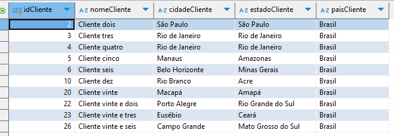

# Preparação

Para iniciar o desafio, foi necessário compreender o modelo conceitual no qual a base de dados estava projetada. 

Para isso, fiz o seguinte esboço:


Após compreender quais campos eram entidades, quais eram atributos e quais eram as suas dependências funcionais, fiz o esquema relacional com os elementos construtores para basear a modelagem, conforme imagem a seguir:


Então, avancei para a etapa 1.

# Etapas


1. [Etapa I](etapa_1) 

    1.1 Nessa etapa. renomeei a tb_locacao para dados e comecei criando as estruturas das tabelas com os códigos a seguir:
    ``` 
    -- locacao definição

        CREATE TABLE locacao 
        (  
        idLocacao INTEGER PRIMARY KEY AUTOINCREMENT,
        dataLocacao DATE NOT NULL,
        horaLocacao TIME NOT NULL,
        qtdDiaria INT NOT NULL,
        vlrDiaria DECIMAL NOT NULL,
        dataEntrega DATE NOT NULL,
        horaEntrega TIME NOT NULL,
        idVendedor INT NOT NULL,
        idCliente INT NOT NULL,
        idCarro INT NOT NULL,
        FOREIGN KEY (idVendedor) 
        REFERENCES vendedor (idVendedor),
        FOREIGN KEY (idCliente) 
        REFERENCES cliente (idCliente), 
        FOREIGN KEY (idCarro) 
        REFERENCES carro (idCarro)
        ); 
       

    -- cliente definição
 
        CREATE TABLE cliente ( 
			idCliente INTEGER PRIMARY KEY AUTOINCREMENT,
			nomeCliente VARCHAR NOT NULL,
			cidadeCliente VARCHAR NOT NULL,
			estadoCliente VARCHAR NOT NULL,
			paisCliente VARCHAR NOT NULL
        );


    -- vendedor definição

        CREATE TABLE vendedor (
		idVendedor  INTEGER PRIMARY KEY AUTOINCREMENT,
		nomeVendedor VARCHAR NOT NULL,
		sexoVendedor SMALLINT CHECK (sexoVendedor IN (0, 1)),
		estadoVendedor VARCHAR NOT NULL 
        );


    -- carro definição

    CREATE TABLE carro (
        idCarro INTEGER PRIMARY KEY AUTOINCREMENT,
    km INT NOT NULL,
     classi VARCHAR NOT NULL,
    marca VARCHAR NOT NULL,
     modelo VARCHAR NOT NULL,
    ano INT NOT NULL,
    idCombustivel INT NOT NULL,
    FOREIGN KEY (idCombustivel)
    REFERENCES 
    combustivel (idCombustivel)
    );


    -- combustivel definição

    CREATE TABLE combustivel (
		idCombustivel INTEGER PRIMARY KEY AUTOINCREMENT,
		tipoCombustivel VARCHAR NOT NULL
    );

1.2 Após a criação das estruturas, inseri os dados iniciais, para fazer 1NF e 2NF, com os seguintes códigos:

    -- cliente inserção

    INSERT INTO cliente (
			idCliente, nomeCliente,
			cidadeCliente, estadoCliente, paisCliente
    )
    SELECT DISTINCT idCliente, nomeCliente,
			cidadeCliente, estadoCliente, paisCliente 
    FROM dados 
Obtive esse retorno:



    -- vendedor inserção
    INSERT INTO vendedor (
		idVendedor, nomeVendedor,
		sexoVendedor, estadoVendedor
    )
    SELECT DISTINCT idVendedor, nomeVendedor,
		sexoVendedor, estadoVendedor
    FROM dados 

O campo sexoVendedor continuou definido como SMALLINT, pois não havia como converter para "M" ou "F" sem saber as especificações para 0 e 1 do projeto.

Obtive esse retorno:


    -- combustivel inserção

    INSERT INTO combustivel (idCombustivel, tipoCombustivel)
    SELECT DISTINCT idCombustivel, tipoCombustivel
    FROM dados 

Obtive esse retorno:


    -- carro inserção

    INSERT INTO carro (idCarro, km, classi, marca, modelo, ano, idCombustivel)
    SELECT DISTINCT dados.idCarro,
			MAX (dados.kmCarro),
			dados.classiCarro,
			dados.marcaCarro,
			dados.modeloCarro,
			dados.anoCarro,
			combustivel.idCombustivel	
    FROM dados JOIN combustivel ON dados.idcombustivel = combustivel.idCombustivel 
    GROUP BY idCarro;

 Para eliminar a dependecia funcional transitiva do campo kmCarro em relação à tabela locação (idlocação), utilizei a função MAX para garantir que o valor inserido seja o último km registrado como informação relevante. Porém, caso o cliente queira comparar os valores de km de cada carro na data de locação e na data de entrega é possível criar uma outra tabela apenas para o atributo multivalorado kmCarro. A tabela kmCarro se relacionaria com a tabela carro com um idKm (km_locacao1, km_locacao2, etc).

 Obtive esse retorno:


    -- locação inserção 
     INSERT INTO locacao (
 					idLocacao, dataLocacao, 
 					horaLocacao, qtdDiaria, 
 					vlrDiaria, dataEntrega,
 					horaEntrega, idVendedor,
 					idCliente, idCarro
 					)
    SELECT DISTINCT dados.idDados, dados.dataLocacao, 
 				dados.horaLocacao, dados.qtdDiaria, 
 				dados.vlrDiaria, dados.dataEntrega,
 				dados.horaEntrega, vendedor.idVendedor,
 				cliente.idCliente, carro.idCarro
    FROM dados 
    JOIN vendedor ON dados.idVendedor = vendedor.idVendedor 
    JOIN cliente ON dados.idCliente = cliente.idCliente 
    JOIN carro ON dados.idCarro = carro.idCarro 
 
    UPDATE locacao 
    SET dataLocacao = SUBSTRING (dataLocacao, 1, 4) || '-' || SUBSTRING(dataLocacao, 5, 2) || '-' ||SUBSTRING(dataLocacao, 7, 2)

    UPDATE locacao
    SET dataEntrega = SUBSTRING (dataEntrega, 1, 4) || '-' || SUBSTRING(dataEntrega, 5, 2) || '-' ||SUBSTRING(dataEntrega, 7, 2)

Na tabela locacao, os campos idCliente, idCarro, idVendedor são as chaves primárias das suas respectivas tabelas que se tornaram chaves estrangeiras. 
Assim, a base de dados tb_locacao atingiu a 3NF e já está em uma normalização aceitável. 

1.3 Após a normalização, o diagrama do modelo relacional ficou como na imagem a seguir:


2.  [Etapa II](etapa_2)

Para a modelagem dimensional, compreendi que o fato que está ocorrendo é locação de carros e as dimensões são pessoas, carros e tempo. 


2.1 Para a dimensão pessoas, decidi detalhar em duas dimensões: vendedor e cliente. 
Como podemos observar no diagrama de conjuntos a seguir:


Aplicando o roll-up:


A dimensão vendedor possui os atributos do vendedor e a dimensão cliente os atributos do cliente.

Podemos obter as dimensões cliente e vendedor pelo seguinte código de view:

     -- dimensão vendedor

     CREATE VIEW dim_vendedor AS
        SELECT
        idVendedor as id,
        nomeVendedor as nome,
        sexoVendedor as sexo,
        estadoVendedor as estado 
        FROM vendedor;

    -- dimensão cliente 

    CREATE VIEW dim_cliente AS
        SELECT
        idCliente as id,
        nomeCliente as nome,
        cidadeCliente as cidade,
        estadoCliente as estado,
        paisCliente as pais
        FROM cliente

E com eles, esses retornos:


2.2 Já para a dimensão tempo, como na tabela locação elaborada no modelo relacional os dias de locação de cada carro são distintos, usei o campo data_locação como chave primária e nomeei de "dimensão data", pois a granularidade do fato é diária. 
Como podemos observar no diagrama de conjuntos a seguir:


Obtive a dimensão data pelo seguinte código de view:

    -- tabela dimensão data por View:

    CREATE VIEW dim_data AS
    SELECT
        dataLocacao,
        horaLocacao,
        dataEntrega,
        horaEntrega
    FROM locacao;

E com ele, esse retorno:


2.3 Na dimensão carro, desnormalizei a tabela carro do modelo relacional, incorporando o atributo combustível nos seus itens descritores.
Como podemos observar no diagrama de conjuntos a seguir:


Obtive a dimensão carro pelo seguinte código de view:

    CREATE VIEW dim_carro AS
    SELECT
        carro.idCarro as id,
        carro.km,
        carro.classi,
        carro.marca,
        carro.modelo,
        carro.ano,
        carro.idCombustivel,
        combustivel.tipoCombustivel
    FROM carro JOIN combustivel ON carro.idCombustivel = combustivel.idCombustivel;

E com ele, esse retorno:


2.4 Para compor o fato locação, utilizei os identificadores das dimensões cliente, vendedor e carro. Assim como a data de locação, utilizei o valor da diária e a quantidade de diárias como medidas do evento locação. 
Obtive a dimensão data pelo seguinte código de view:

    -- tabela fato locacao por View 

    CREATE VIEW ft_locacao AS 
    SELECT idLocacao, 
        idVendedor, 
        idCliente, 
        idCarro, 
        dataLocacao,
        qtdDiaria, 
        vlrDiaria 
        FROM locacao;

E com ele, esse retorno:


# Conclusão do desafio Sprint 2

Para concluir, após a desnormalização do modelo relacional e o reagrupamento dos registros, o diagrama do modelo dimensional ficou como na imagem do esquema estrela a seguir:


