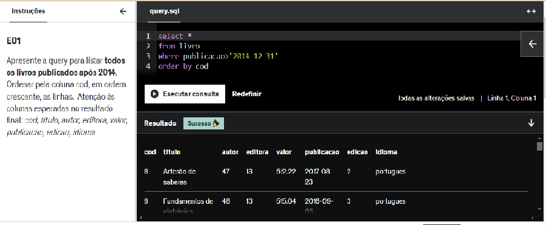
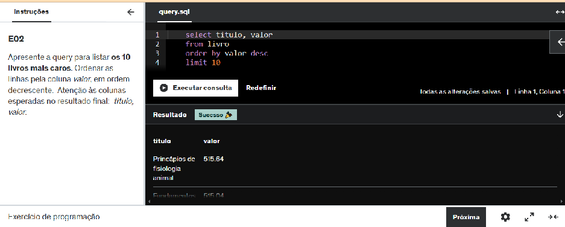
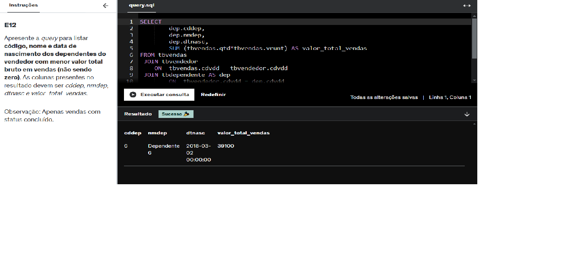
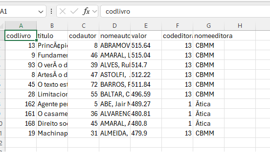
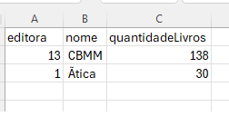

# Resumo
Nesta sprint aprendi sobre os Sistemas Gerenciadores de Base de Dados (SGBD) relacionais e a linguagem usada para sua execuções: o SQL (Structured Query Language); e suas subdivisões: DDL (Data Definition Language), DML (Data Manipulation Language), DQL (Data Query Language). Assim como os tipos de modelos de banco de dados: conceitual, lógico, físico e dimensional. 
Como forma de consolidar os conhecimentos adquiridos, elaborei um modelo relacional e dimensional de uma base da dados no desafio da Sprint. 
Outro assunto abordado foi a proposta de valor da AWS (Amazon Web Service) e conceitos fundamentais para os serviços de computação em nuvem. 

# Exercícios

|  Linguagem   |   SQL    |
|------------ | ----- |
| [Resposta Ex1.](Exercicios/ex01.sql) |   [Resposta Ex2.](Exercicios/ex02.sql)|
| [Resposta Ex3.](Exercicios/ex03.sql) | [Resposta Ex4.](Exercicios/ex04.sql) |
| [Resposta Ex5.](Exercicios/ex05.sql) |  [Resposta Ex6.](Exercicios/ex06.sql)|
| [Resposta Ex7.](Exercicios/ex07.sql) |  [Resposta Ex8.](Exercicios/ex08.sql) |
| [Resposta Ex9.](Exercicios/ex09.sql) |  [Resposta Ex10.](Exercicios/ex10.sql) | 
| [Resposta Ex11.](Exercicios/ex11.sql) | [Resposta Ex12.](Exercicios/ex12.sql) |
| [Resposta Ex13.](Exercicios/ex13.sql) | [Resposta Ex14.](Exercicios/ex14.sql) |
| [Resposta Ex15.](Exercicios/ex15.sql) | [Resposta Ex16.](Exercicios/ex16.sql) |
| [Resposta Ex17.](Exercicios/ex17.sql) |[Resposta Ex18.](Exercicios/ex18.sql) |

| exportação de | arquivos csv|
| --- | --- |
| [ETAPA 1](Exercicios/ex17.csv) | [ETAPA 2](Exercicios/ex18.csv) |

# Evidências

Ao executar o código dos exercícios 1 e 2 do caso de estudo da biblioteca, obtive o seguinte retorno: 

Ao executar o código do exercício 12 do caso de estudo da loja, obtive o seguinte retorno: 

Os demais exercícios podem ser consultados [aqui](exercicios) 

Ao realizar a exportação de dados para o csv, obtive as seguintes tabelas:

# Certificados

Certificado da AWS Skill Builder

