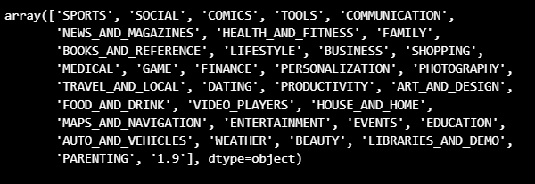

# Preparação

Para iniciar o desafio, foi necessário preparar o ambiente, instalando e importando as bibliotecas Pandas e Matplotlib. Os comandos usados foram:

``` !pip install pandas #instala o pandas ``` 

``` import pandas as pd #importa o pandas ```

``` !pip install matplotlib #instala o matplotlib ```

``` import matplotlib.pyplot as plt #importa o matplotlib```

Então avancei para a etapa do desenvolvimento do notebook.

# [Desenvolvimento](desafio_sprint-3.ipynb)

Nesta etapa foram propostas atividades utilizando as bibliotecas Pandas e Matplotlib. Para isso dividi o notebook nas subetapas a seguir:

1. Tratando inconsistências iniciais nos dados

Comecei ordenando os dados do dataset, retirei as duplicatas de todos os campos e, ao analisar os tipos e valores únicos, deparei-me com uma linha fora da formatação das demais em "Category", como podemos ver na imagem a seguir:



Percebi que os dados das demais colunas estavam recuados à esquerda e apenas estava faltando o elemento "Category". Optei por tratar a linha através de uma cópia e inserir o termo "Não informado" em "Category". Assim, a linha ficou com uma coluna adicional. Porém, como o último valor era N/A e os demais estavam de acordo com o padrão das colunas, excluí esse elemento. Com isso, a linha voltou a ter o mesmo padrão do dataset. Para finalizar, inseri a linha já tratada no dataset e excluí a original. Vejamos a seguir como ficou a linha:


Então prossegui para a próxima subetapa.

2. Convertendo os tipos de dados do Dataset

Como todos os dados do dataset estavam em formato de object, decidi converter algumas colunas para tipos numéricos, para conseguir realizar as atividades pedidas nas próximas subetapas. As colunas tratadas inicialmente foram: Reviews, Size, Installs. Vejamos a seguir como ficaram após o tratamento:


Então prossegui para a próxima subetapa.

3. Gráfico top 5 apps instalados

Ao olhar novamente os dados no dataset para construir o gráfico, observei que os nomes dos apps continuavam duplicados, assim como as demais colunas, com excessão do número de Reviews.  Vejamos a seguir como estavam os dados:


 Portanto, ainda havia linhas duplicadas. Porém, com dois valores para Review por app. Assim, optei por criar um dataframe ordenando o dataset pelo número de installs (por ser uma coluna numérica), depois por Reviews e, então, remover as linhas duplicadas. Assim, apenas ficaram no dataframe os maiores valores de Reviews. Como pode ser observado a seguir:


Após o tratamento, prossegui para criar um dataframe com  os 5 apps mais instalados. Porém, exitiam muitos apps com o mesmo número de installs, porque esses dados foram contabilizados só até atingirem a marca de 1 bilhão. Então, pensei que seria importante adicionar um critério de desempante e escolhi o número de Reviews. Vejamos a seguir como ficou o gráfico de barras do top 5 apps mais instalados:


Obs.: Como todos possuem o mesmo número registrado de instalações, mesmo adicionando o critério de desempate, ainda pode-se observar que este não é um modelo de gráfico adequado para essa situação. Entretato, não consegui formular outra proposta em tempo hábil para a conclusão deste desafio.

Então prossegui para a próxima subetapa.

4. Gráfico de setores das categorias de apps

Para elaborar o gráfico de setores das categorias de apps, retirei os apps com os nomes duplicados e conferi se haviam dados faltantes nas colunas app e category. Como não haviam, agrupei os apps por category e contabilizei quantos apps cada categoria possuia. Esses dados foram armazenados no dataframe "frequencia_categoria" e serviram de base para criar o gráfico de setores a seguir:


Então prossegui para a próxima subetapa.

5. App mais caro da loja

Como não iniciei o desafio tratando a coluna Price, foi necessário fazê-lo neste momento. Essa coluna possuia um caracter especial "$" que foi retirado e converti ela em "float". Então ordenei os dados da coluna do maior para o menor, para visualizar o app com o maior preço no dataframe. Então usei o código ```loja_google_price["Price"].max()``` para acessar somente a linha de valor máximo e ```loja_google_price[condicao][["App", "Price"]]``` para exibir apenas a coluna com o nome do app e o preço. Vejamos a seguir como ficou a tabela:


Então prossegui para a próxima subetapa.

6. Apps classificados como 'MATURE +17'

Analisei os elementos categóricos da coluna "Content Rating" e encontrei a classificação 'Mature 17+'. Então filtrei os dados pelo termo e, depois de tratar os dados do dataset, obtive uma tabela apenas com os nomes dos apps dessa classificação. Veja na imagem a seguir:


Então prossegui para a próxima subetapa.

7. Top 10 apps por Reviews

Para obter a tabela com o top 10 apps por Reviews, ordenei o dataset pela respectiva coluna e depois usei o comando ``` loja_google_reviews.head(10) ``` para extrair as dez primeiras linhas. Logo após criei outra tabela apenas com o nome dos apps e a quantidade de reviews. Veja como ficou a tabela:


Então prossegui para a próxima subetapa.

8. Top 30 apps por preço

Baseada na atividade dos top 10 apps por reviews, decidi fazer um top 30 para analisar melhor como se comportam os preços dos primeiros 30 apps da loja. Obtive a seguinte tabela:


Então prossegui para a próxima subetapa.

9. A média dos preços dos Apps

Observei pela amostra dos 30 apps mais caros que existia uma mudança de preço muito abrupta do app mais caro da tabela para o último colocado. Decidi então calcular a média, obtida pelo código ```media = loja_google_price['Price'].mean()```, que gerou o seguinte dataframe:


Então prossegui para a próxima subetapa.

10. Gráfico de linhas dos preços por aplicativo (top 30)

Com base no dataframe do top 30 apps por preço, elaborei o seguinte gráfico de linhas para observar o comportamento dos preços por apps:


Então prossegui para a próxima subetapa.

11. Gráfico de dispersão dos preços dos aplicativos em relação à média 

Usando a média calculada na atividade da subetapa 9, elaborei um gráfico de dispersão dos preços do dataset. Comparando-os pude constatar que:
- existem poucos apps pagos
- a maioria dos apps são gratuitos ou estão abaixo da média de preços

Vejamos na imagem a seguir:


E com este último gráfico concluí o desafio.