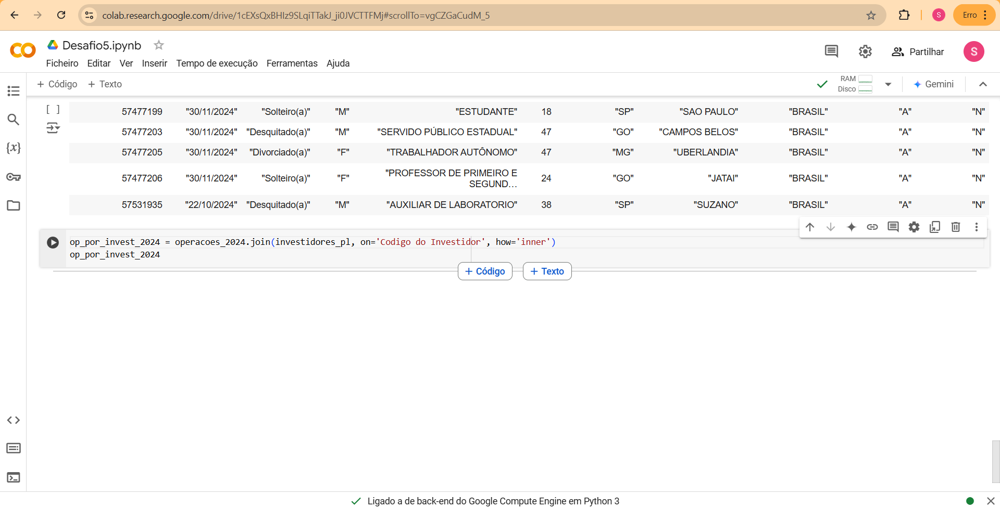

O objetivo do desafio dessa sprint é praticar os conhecimentos de AWS.

Para isso, era necessário criar um script python para tratar uma base de dados originária do Portal de Dados Abertos. 

Inciei o desafio delimitando o tema e a base de dados para elaboração do script.

Escolhi como conjunto de dados dois arquivos do Ministério da Fazenda sobre o título público de investimento chamado "Tesouro Direto": 
"Investidores do Tesouro Direto de 2024" e "Operações do Tesouro Direto", ambos em formato csv. 

Segundo o site do [Tesouro Nacional](https://www.tesourotransparente.gov.br/temas/divida-publica-federal/tesouro-direto) o programa Tesouro Direto é: "... um Programa do Tesouro Nacional desenvolvido em parceria com a B3 (bolsa de valores) para venda de títulos públicos federais para pessoas físicas, por meio da internet."

Foi necessário juntar os dois arquivos, pois eles se complementam (um com os dados dos investidores e outro com as operações financeiras).

Os arquivos mencionados se tratavam de arquivos muito grandes, de Big Data, e como eu não possuo uma máquina adequada para lidar com eles então fiz um recorte para um dataset com os investidores que se cadastraram no programa em 2024 e operaram nele. 

Confira o tratamento nas imagens a seguir:

Para fazer esse recorte usei a biblioteca polars do python.

Após fazer o recorte consegui subir o arquivo csv para o serviço S3 da AWS e prossegui para a análise da base de dados com a biblioteca pandas.

Em um primeiro momento importei as bibliotecas citadas nas orientações, li o arquivo csv e identifiquei a necessidade de fazer conversões de dados em algumas colunas para fazer a análise. 

Veja algumas manipulações abaixo:

Como questão norteadora busquei traçar o perfil  dos investidores que aderiram ao tesouro direto em 2024 e operaram na modalidade compra no primeiro semestre. 

Para isso filtrei entre entre os meses de janeiro a junho, agrupei por Tipo de Título, Mes da Operação, Genero, Profissão, UF do Investidor e agreguei esse dados com a media das idades e a soma da quantidade de compras realizadas. 

Além disso, adicionei uma classificação para cada grupo de investidores comparando as operações realizadas com a média, sendo elas "baixa" para operações abaixo da média, "itermediária" para operações próximas a média e "alto" para operações acima da média. 

Assim, foi gerado um dataframe onde é possível comparar os grupos dessa amostra estratificada e usá-lo para tomar decisões pensando nos diferentes públicos que estão investindo nesses títulos públicos. E, por fim, esse arquivo foi armazenado no serviço s3 da AWS por meio do script [upar_datasep](upar_dataset.py) assim como a base de dados original.

Conforme está comprovado na imagem abaixo:

E com isso, conclui o desafio.

1) OBS.: Mesmo com o recorte e a redução do volume dos dados foi necessário comprimir os arquivos csv para subi-los no repositório, pois o GitHub tem um limite de 100 MiB de dados por arquivo.

2) OBS.: Para fazer o scrip para upar o arquivo csv para o S3 foi necessário usar o caminho completo, pois no meu computador ele não estava reconhecendo o abreviado. 

