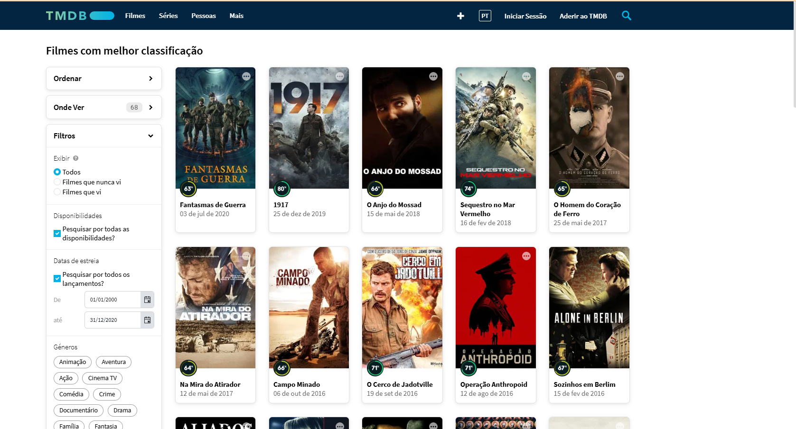

# Análise Exploratória

O tema para o desafio final da minha squad foi definido como "Filmes e séries de Crime/Guerra". Ao fazer uma análise exploratória no arquivo csv recebido 

e no site do TMDB 

pude definir como hipotese inicial que:

**aparentemente, o tema principal desse gênero nos últimos 20 anos foi Segunda Guerra Mundial**.

Assim, pude estabelecer as seguintes perguntas abrangendo os quatro tipos de análise de dados e uma combinação delas:

**- Análise Descritiva**

Qual é a distribuição dos orçamentos dos filmes sobre a Segunda Guerra Mundial ao longo dos anos 2000 a 2020? Como isso se relaciona com as bilheterias?

**- Análise Diagnóstica**
Por que filmes de guerra com temática da Segunda Guerra Mundial continuam a ser populares mesmo décadas após o fim do conflito?

**-Análise Preditiva**

Quais são os principais fatores que influenciaram no desempenho dos filmes sobre a Segunda Guerra Mundial nas bilheterias?

**-Análise Prescritiva**

Quais são as melhores práticas para a produção de um filme sobre a Segunda Guerra Mundial de sucesso comercial?

**-Análise Combinada**

Quais são as oportunidades para a criação de filmes inovadores que atendam às demandas do público?

Um bom motivo para esse tema de análise é:

- identificar como a Segunda Guerra Mundial é representada na cultura popular e como essa representação evolui ao longo do tempo; 
 
- identificar padrões e tendências na narrativa; 

- ao analisar como os filmes sobre a Segunda Guerra Mundial são recebidos pelo público, podemos entender como esses filmes moldam a memória coletiva e influenciam a visão que as pessoas têm sobre o passado;

 - ajudar a identificar oportunidades de mercado, a avaliar o potencial de sucesso de novos projetos e a tomar decisões mais informadas sobre a produção e distribuição de filmes. 

 Essas perguntas abordam diferentes aspectos e, com elas, é possível obter bons insights e identificar oportunidades de negócios através das KPI's da indústria cinematográfica. 

 Com isso, segui para a primeira etapa do desafio final.

 # ETAPA 1 - INGESTÃO BATCH

 Nesta etapa, iniciei criando um código python para subir os arquivos CSVs para um bucket definido com RAW Zone no AWS S3 conforme o modelo de gravação indicado nas orientações.

 Segue imagem com o código:

 

 Logo após, criei um script para um arquivo Dockerfile para criar um container que fizesse o upload dos arquivos para o AWS s3.

 Podemos conferir na imagem a seguir esse script e a criação da imagem do container:

 

Executando o container docker e fazendo a ingestão:

 

