# Resumo
Nesta sprint aprendi sobre os serviços de Data & Analytics da AWS, aprofundando cos conhecimentos de Athena e Lambda ao colocando a mão na massa nos laboratórios. 

# Exercícios

Nessa Sprint realizei exercícios que exploraram: 

1) Configurar o Athena; criar nele um banco de dados e uma tabela através de uma query.

A seguir as imagens da execução do exercício:

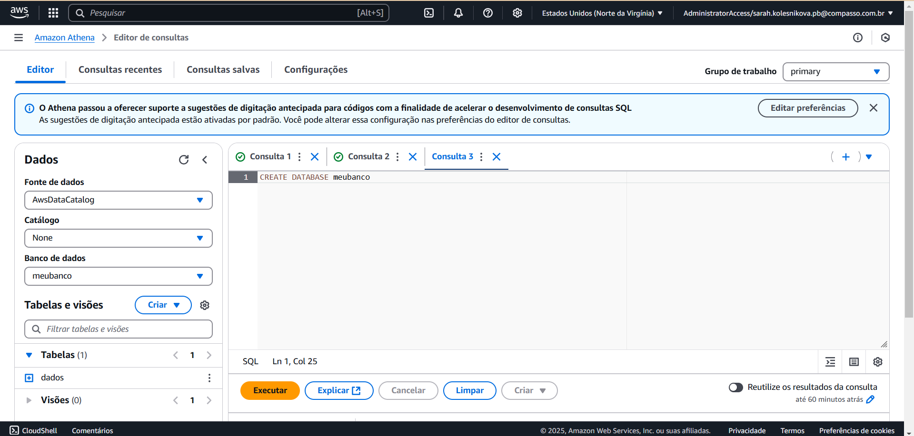

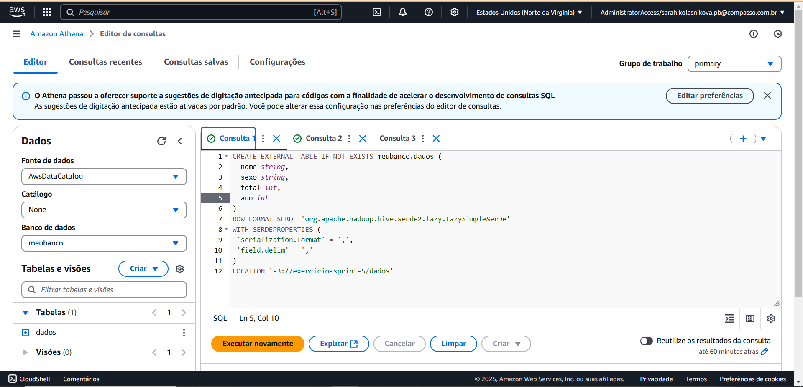

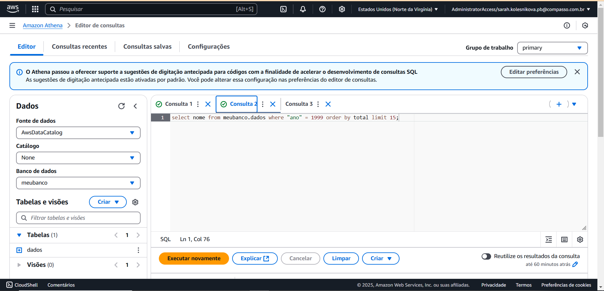

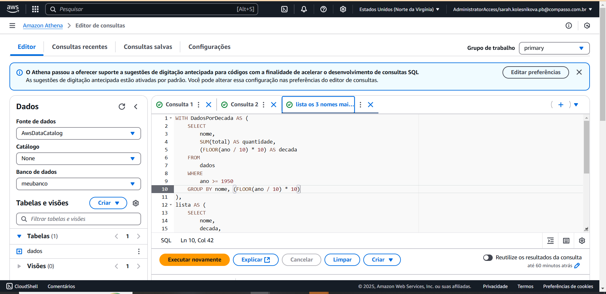

[Aqui](./Exercicios/Lab-AWS-Athena/athena.zip) você pode acessar os arquivos gerados com as consultas. 

2) Criar uma função no Lambda e construir um código python para ser executado dentro deste serviço utilizando layers. 

A seguir as imagens da execução do exercício:

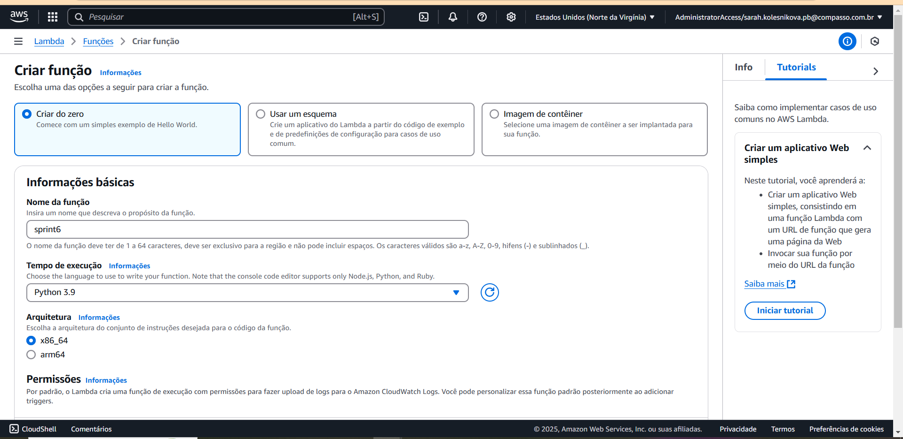

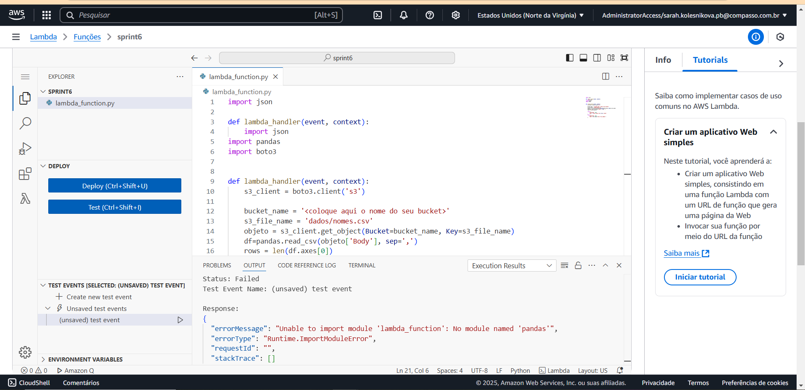

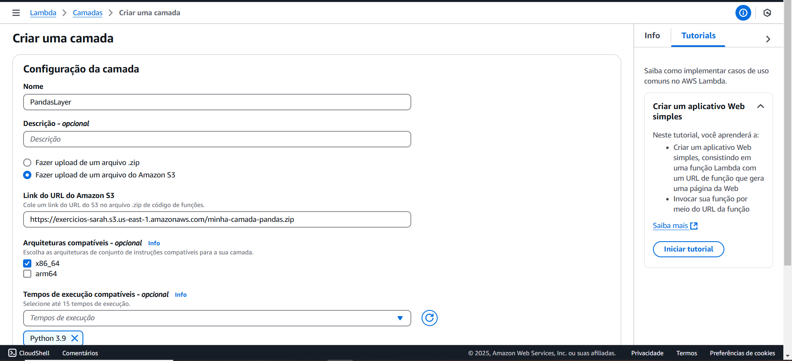

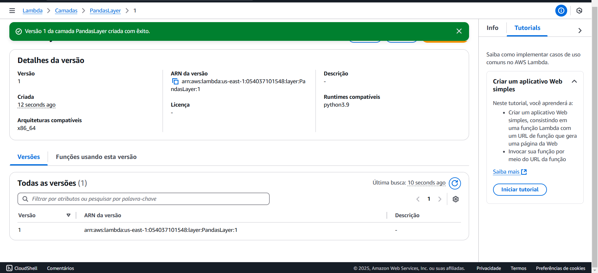

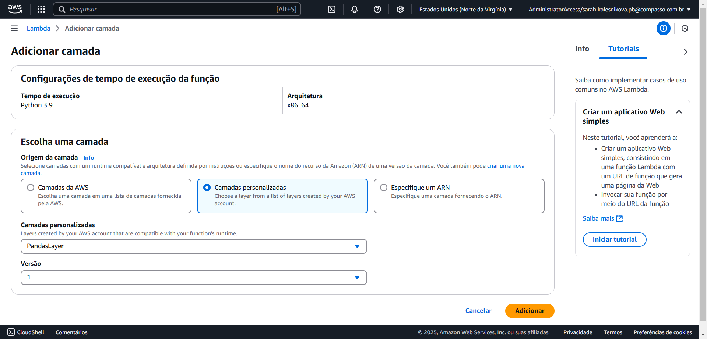

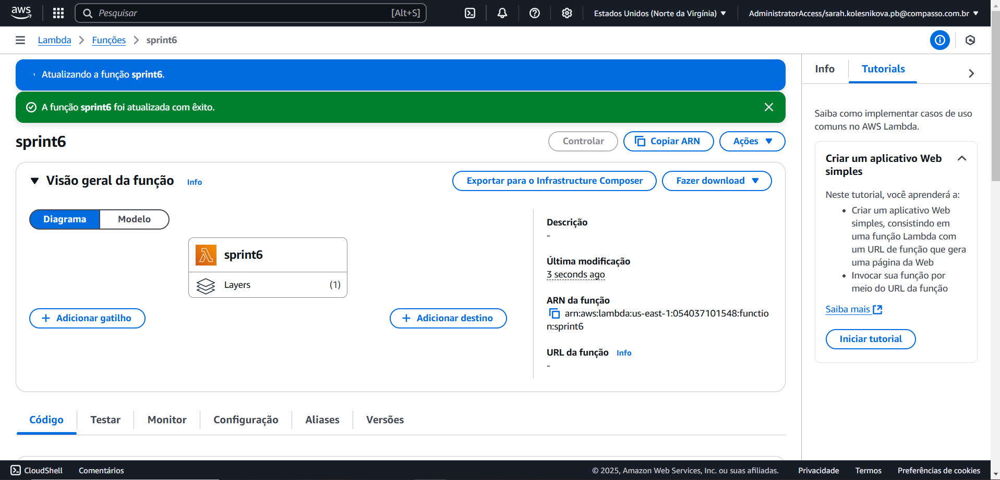

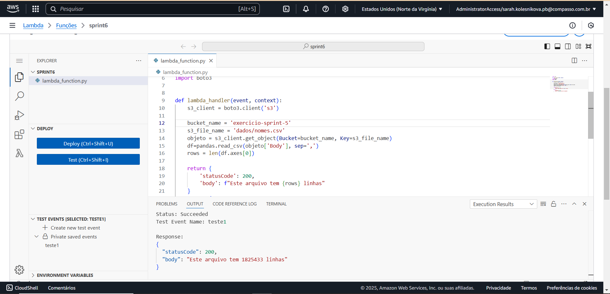

[Aqui](./Exercicios/Lab-AWS-Lambda/Dockerfile) você acessa o arquivo dockerfile.

[Aqui](./Exercicios/Lab-AWS-Lambda/minha-camada-pandas.zip) os arquivos compactados. 

# Desafio

Para acessar o desafio clique [aqui](Desafio/README.md)

# Evidências

As evidências do desafio podem ser acessadas [aqui](Evidencias/)

# Certificados

Certificados da AWS Skill Builder:

[Noções básicas de Analytics na AWS – Parte 1 (Português)](Certificados/NocoesbasicasdeAnalyticsnaAWS-Parte-1-(Portugues).pdf)

[Fundamentos de analytics na AWS – Parte 2 (Português)](Certificados/FundamentosDeAnalyticsAWSParte2(Portugues).pdf)

[Serverless Analytics (Português)](Certificados/ServerlessAnalytics(Portugues).pdf)

[Introduction to Amazon Athena (Português)](Certificados/IntroductionToAmazonAthena(Português).pdf)

[AWS Glue Getting Started](Certificados/AWSGlueGettingStarted.pdf)

[Amazon EMR Getting Started](Certificados/AmazonEMRGettingStarted.pdf)

[Getting Started with Amazon Redshift (Português)](Certificados/GettingStartedWithAmazonRedshift(Portugues).pdf)

[Best Practices for Data Warehousing with Amazon Redshift (Portuguese)](Certificados/BestPracticesForDataWarehousingWithAmazonRedshift(Portuguese).pdf)

[Amazon QuickSight - Getting Started](Certificados/AmazonQuickSightGettingStarted.pdf)