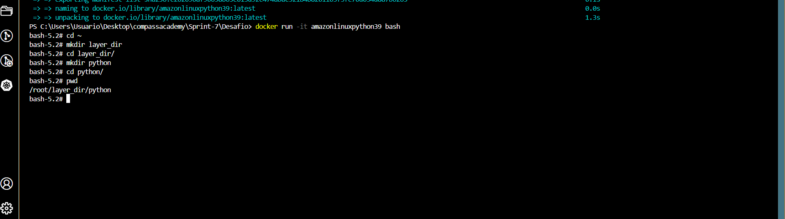
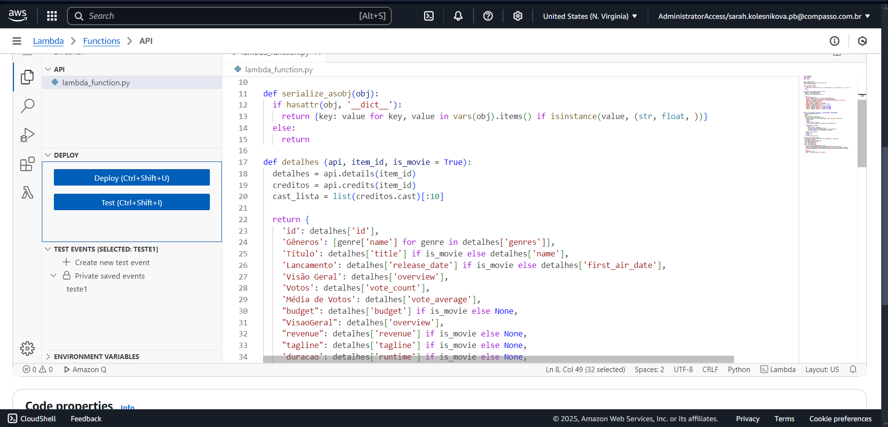
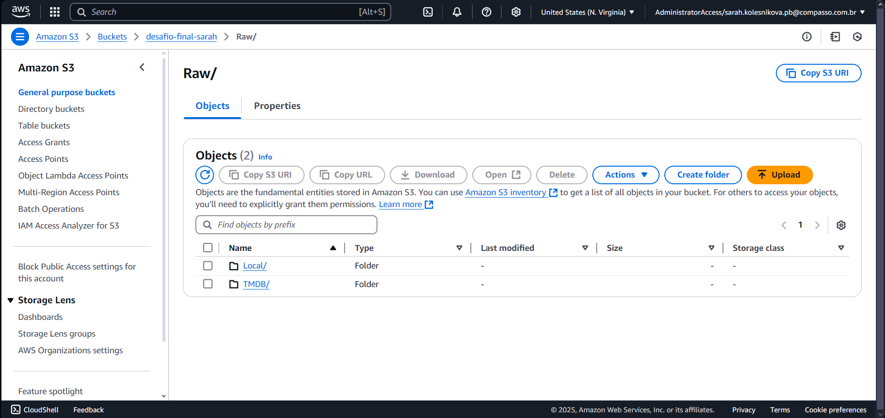

# PREPARAÇÃO

O desafio desta sprint consistiu em capturar dados do TMDB via AWS Lambda via API. 

A motivação de usar a API do TMDB é complementar os dados fornecidos na ingestão de Batch na [entrega 1](/Sprint-6/Desafio/README.md). 

As questões que serão respondidas são:

1 - Qual é a distribuição dos orçamentos dos filmes sobre a Segunda Guerra Mundial ao longo dos anos 2000 a 2020? Como isso se relaciona com as bilheterias?

2 - Por que filmes de guerra com temática da Segunda Guerra Mundial continuam a ser populares mesmo décadas após o fim do conflito?

3 - Quais são os principais fatores que influenciaram no desempenho dos filmes sobre a Segunda Guerra Mundial nas bilheterias?

4 - Quais são as melhores práticas para a produção de um filme sobre a Segunda Guerra Mundial de sucesso comercial?

5 - Quais são as oportunidades para a criação de filmes inovadores que atendam às demandas do público?

A explicação das questões está na análise exploratória da [sprint 6](/Sprint-6/Desafio/README.md). 

# ENTREGA 2 - INGESTÃO DE API

Para realizar a ingestão de API do TMDB, primeiramente desenvolvi o script [API](./API.py) contendo cinco partes:

1) Importei as bibliotecas e a declaração de variáveis gerais:

``` 
import datetime 
import tmdbv3api 
import json 
import boto3 

tmdb = tmdbv3api.TMDb() 
tmdb.api_key = 'INSERIR CHAVE AQUI' 
filmes = tmdbv3api.Movie() 
```

2) Criei uma função que serializa os dados para que sejam convertidos para JSON mais facilmente:

```
def serialize_asobj(obj): # Função para serializar o objeto
  if hasattr(obj, '__dict__'):
    return {key: value for key, value in vars(obj).items() if isinstance(value, (str, float, int, list, dict, bool))}
  else:
    return
```

3) Criei uma segunda função que retorna um dicionário com as informações sobre o filme que serão usadas para a análise:

```
def detalhes (api, item_id, is_movie = True): # Função para detalhar os filmes
  detalhes = api.details(item_id)
  creditos = api.credits(item_id)
  cast_lista = list(creditos.cast)[:10]
  return {
    'id': detalhes['id'],
    'Gêneros': [genre['name'] for genre in detalhes['genres']],
    'Titulo': detalhes['title'] if is_movie else detalhes['name'],
    'Lancamento': detalhes['release_date'] if is_movie else detalhes['first_air_date'],
    'Visão Geral': detalhes['overview'],
    'Votos': detalhes['vote_count'],
    'Média de Votos': detalhes['vote_average'],
    "budget": detalhes['budget'] if is_movie else None,
    "VisaoGeral": detalhes['overview'],
    "revenue": detalhes['revenue'] if is_movie else None,
    "tagline": detalhes['tagline'] if is_movie else None,
    'duracao': detalhes['runtime'] if is_movie else None,
    "imdb_id": detalhes['imdb_id'] if is_movie else None
  }
```

4) Criei uma terceira função para filtrar os filmes com um dos gêneros da minha squad (war), pois o tema principal da minha análise que é Segunda Guerra Mundial está contido nesse gênero. E adicionei um intervalo de tempo, pois irei analisar os filmes de 2000 a 2020:
```
def filmes_filtrados(filmes, genero_id, max_results, ano_inicial=None, ano_final=None): # Função para filtrar os filmes
  discover = tmdbv3api.Discover()
  resultados = []
  page = 1
  while len(resultados) < max_results:
    resposta = discover.discover_movies({'page': page, 'with_genres': genero_id}) 
    if not resposta:
      break
    filtros = [
      item for item in resposta
      if hasattr(item, 'genre_ids') and genero_id in item.genre_ids
    ]
    if ano_inicial or ano_final:
      filtros = [
        item for item in filtros
        if hasattr(item, 'release_date') and 
        (ano_inicial is None or item.release_date >= ano_inicial) and 
        (ano_final is None or item.release_date <= ano_final)
      ]
    resultados.extend(filtros)
    page += 1
    if page > 500:
      break
  return resultados[:max_results]

```
5) E, por fim, utilizei a função Lambda que irá executar as outras na AWS e salvar os dados em arquivos JSON com no máximo 100 linhas cada (como pedido) na pasta RAW do bucket do S3 usado para o desafio:

```
def lambda_handler(event, context): # Função principal
  filmes_guerra = filmes_filtrados(filmes, 10752, 5000, "2000-01-01", "2020-12-31")
  s3 = boto3.client('s3')
  bucket_name = 'desafio-final-sarah'
  now = datetime.datetime.now()
  ano = now.strftime('%Y')
  mes = now.strftime('%m')
  dia = now.strftime('%d')
  for i in range(0, len(filmes_guerra), 100): # Loop para salvar os filmes no S3
    s3_path = f'Raw/TMDB/JSON/{ano}/{mes}/{dia}/filmes_guerra_{i//100+1}.json'
    filmes_guerra_serialized = [serialize_asobj(filme) for filme in filmes_guerra[i:i+100]]
    s3.put_object(Bucket=bucket_name, Key=s3_path, Body=json.dumps(filmes_guerra_serialized))

  return {
    'statusCode': 200,
    'body': json.dumps({"dados salvos com sucesso": f"s3://{bucket_name}"})
  }
```

Para executar o script no Lambda da AWS, foi necessário criar camadas Layers para instalar as bibliotecas 
usadas no código com um container Docker gerado pelo arquivo [dockerfile](./Dockerfile), conforme as imagens a seguir:





O resultado gerou o arquivo [minha-camada-api](./minha-camada-api.zip) usado para criar a Layer.

Criada a Layer e adicionada a função gerada já no ambiente AWS Lambda, executei o código conforme as imagens abaixo:




E, por fim, as imagens de confirmação da ingestão dos dados no bucket do S3:




E, com isso, conclui o desafio dessa sprint. 