# Resumo
Nesta sprint, aprendi sobre o framework de processamento de dados Apache Spark e realizei os laboratórios práticos de serviços da AWS.

# Exercícios

Nesta Sprint, realizei exercícios que exploraram:

1) Criação de um [script](./Exercicios/Contador-de-palavras-spark/contador.py) com pyspark para contar palavras.

A seguir as imagens da execução do exercício:

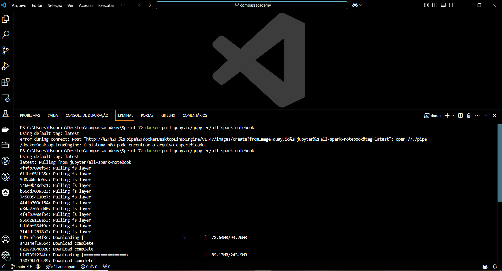

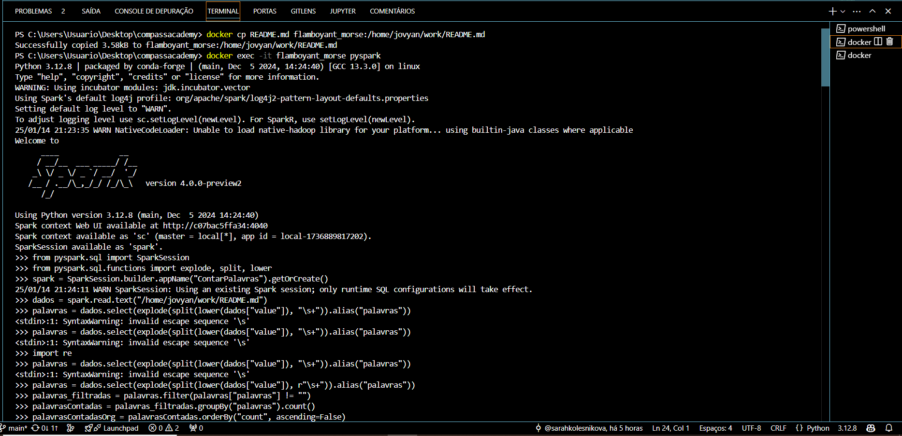

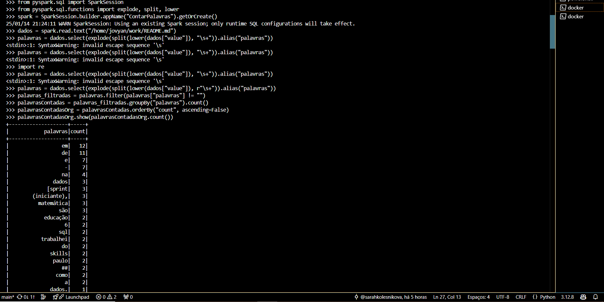

2) Extração de dados da API do TMDB com python:

[código aqui](./Exercicios/TMDB/api.py)

 - Criar a conta:

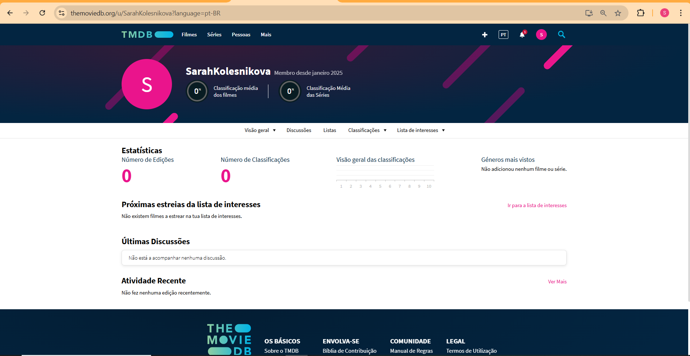

 - Fazer a consulta:

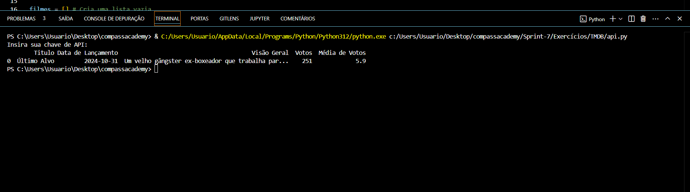

3) Construção de um processo de ETL simplificado, utilizando o serviço AWS Glue:

[Exemplo Glue](./Exercicios/Glue/exemplo.py)

 - script [Sua vez!](./Exercicios/Glue/gluelab.py)

 - Job:

 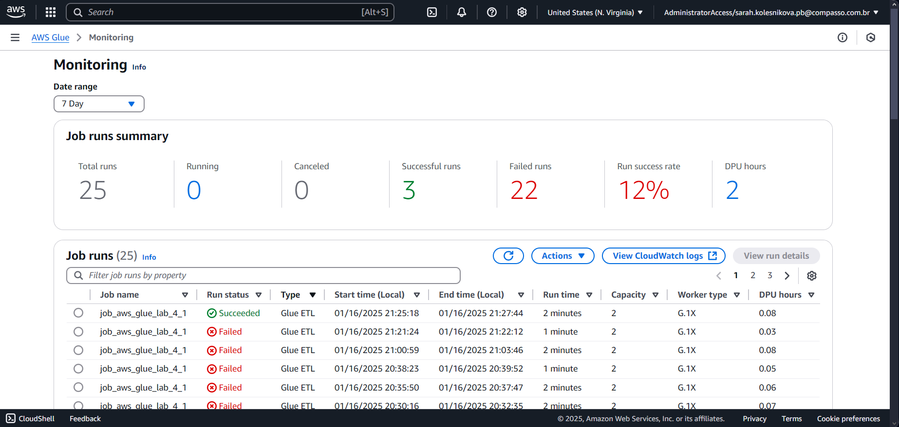

 - Log:

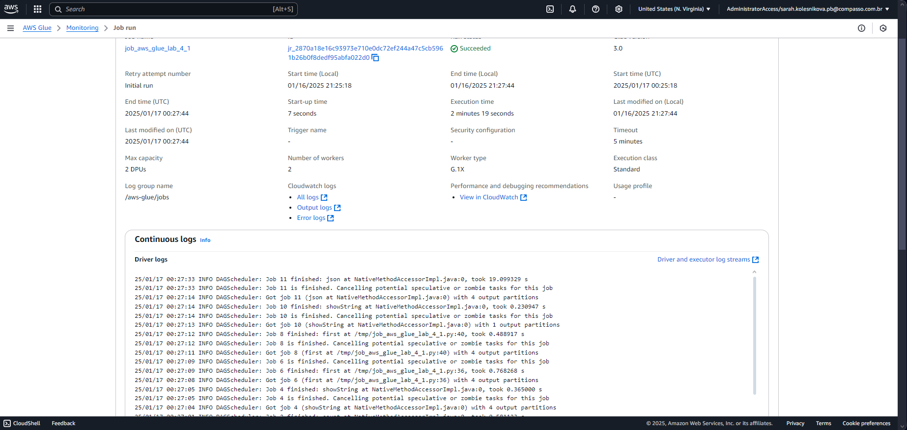

 - crawler:

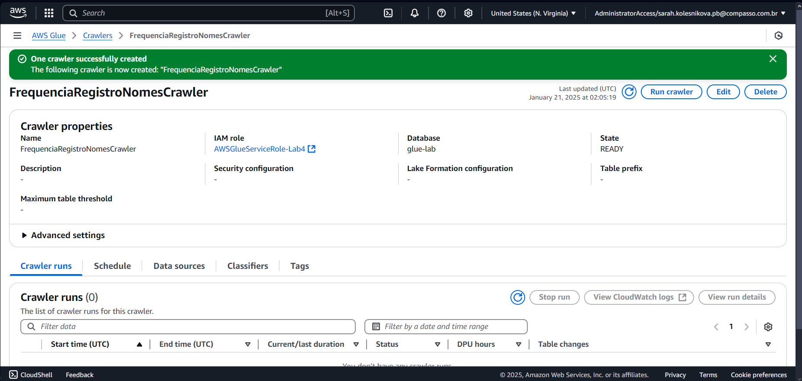

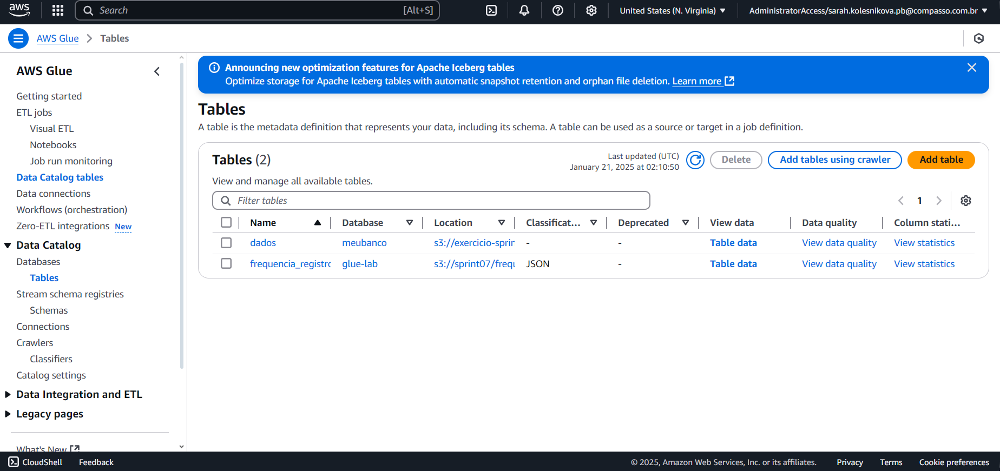

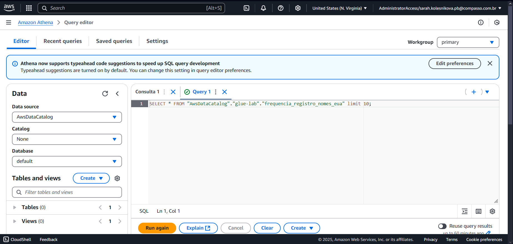

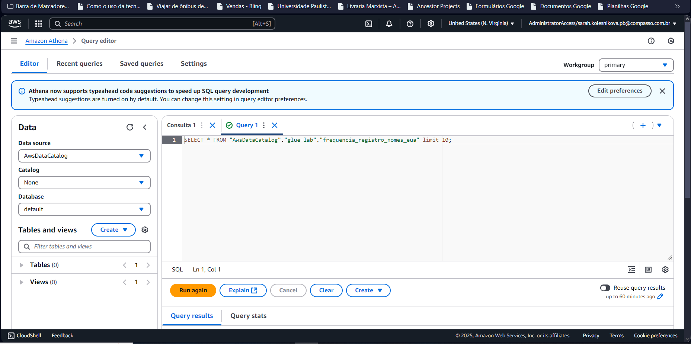

# Desafio

Para acessar o desafio, clique [aqui](Desafio/README.md)

# Evidências

As evidências do desafio podem ser acessadas [aqui](Evidencias/)

# Certificados

Nesta sprint não foram ofertados cursos da AWS. 