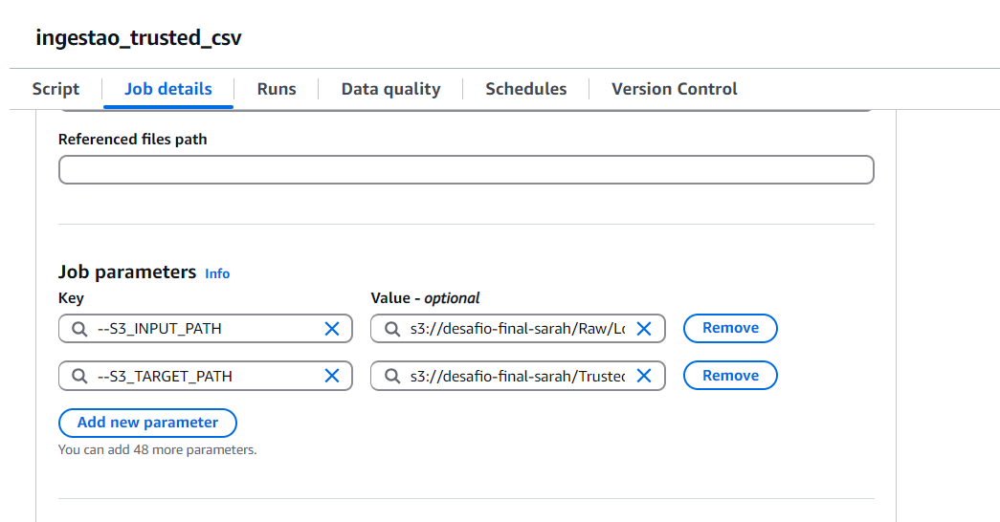
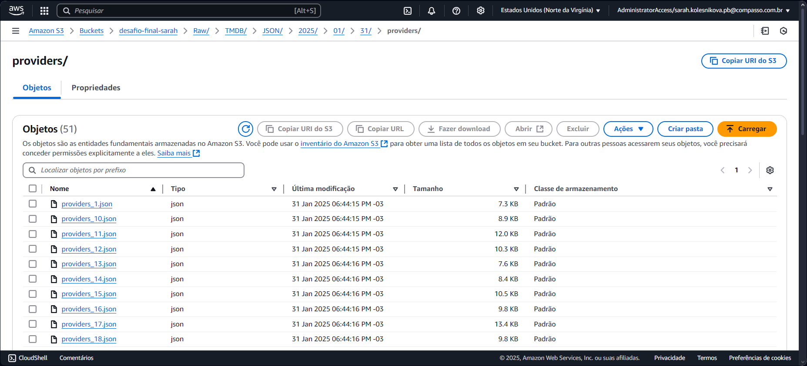

# PREPARAÇÃO

O desafio desta sprint consistiu em fazer uma nova ingestão de dados de fontes de origem diferentes existentes na camada RAW, processá-los de forma que fiquem padronizados no formato .parquet e gerar uma nova camada do Data Lake no S3, chamada de Trusted Zone. Após a ingestão, os dados tratados ficam disponíveis em um database no Glue Data Catalog e podem ser acessados com o AWS Athena, ou seja, são integrados com outros serviços da AWS.

As perguntas que orientam o desafio e são a base para as escolhas feitas durante esta sprint são:

1 - Qual é a distribuição dos orçamentos dos filmes sobre a Segunda Guerra Mundial ao longo dos anos 2000 a 2020? Como isso se relaciona com as bilheterias?

2 - Por que filmes de guerra com temática da Segunda Guerra Mundial continuam a ser populares mesmo décadas após o fim do conflito?

3 - Quais são os principais fatores que influenciaram no desempenho dos filmes sobre a Segunda Guerra Mundial nas bilheterias?

4 - Quais são as melhores práticas para a produção de um filme sobre a Segunda Guerra Mundial de sucesso comercial?

5 - Quais são as oportunidades para a criação de filmes inovadores que atendam às demandas do público?

A explicação das questões está na análise exploratória da [sprint 6](/Sprint-6/Desafio/README.md). 

# ENTREGA 3 - PROCESSAMENTO DA CAMADA TRUSTED

## INGESTÃO NA TRUSTED DE DADOS DO CSV

### INTRODUÇÃO

O AWS Glue é um serviço de gerencimento de integração de dados da AWS que automatiza o processo de ETL para construção de Data Lakes ou Data Warehouses. 

Os benefícios do Glue são: escalabilidade, flexibilidade, ser um serviço sem servidor, possuir integração com outros serviços da AWS, principalmente os de Analytics, ser *on demand* e ter um bom custo-beneficio. Assim, com o AWS Glue, pode-se trabalhar com grandes volumes de dados para prepará-los para as análises. 

Um bom exemplo de escalabilidade do Glue é a criação de pipeline de ETL, ou seja, criar fluxos de trabalho automatizados de ETL. 

Telas iniciais do Glue:
- Na Visual ETL, os jobs criados ficam disponíveis na parte **your jobs**. Na parte **create job**, temos três opções de iniciar um job. No programa de bolsas, utilizamos a opção **script editor**:


- Essa é a tela inicial de um novo job:


Ao iniciar um script spark no AWS Glue, ele tem por padrão as seguintes linhas:

```
import sys
from awsglue.transforms import *
from awsglue.utils import getResolvedOptions
from pyspark.context import SparkContext
from awsglue.context import GlueContext
from awsglue.job import Job

## @params: [JOB_NAME]
args = getResolvedOptions(sys.argv, ['JOB_NAME'])

sc = SparkContext()
glueContext = GlueContext(sc)
spark = glueContext.spark_session
job = Job(glueContext)
job.init(args['JOB_NAME'], args)
job.commit()

```
Para construir os meus jobs, adicionei bibliotecas, **args** e linhas de código entre os comandos ```job.init(args['JOB_NAME'], args)``` e ```job.commit()```.  Os **args** são **jobs parameters** cadastrados na aba **jobs details** de cada job.
Apesar das orientações indicarem que era para realizar 2 jobs para o processamento, por ser iniciante em programação Python com pyspark, eu tive dificuldades para fazer a depuração de códigos muito extensos no Glue (mesmo consultando a tela de logs). Então, aplicando o pilar da Decomposição do Pensamento Computacional, separei o código em 3 partes e usei 3 jobs e escolhi o ELT (já que se trata de um data lake) dos dados do CSV da RAW.

### INICIALIZAÇÃO DO GLUE PARA EXTRAÇÃO DE DADOS DO CSV DA CAMADA RAW COM FILTRO PELO GÊNERO 'WAR'

O primeiro código do CSV extrai apenas os dados dos filmes que possuem a palavra 'War' na coluna genero, pois é o tema da minha squad. Para isso, foi necessário acrescentar no início da script padrão do Glue as bibliotecas:

```
import boto3
from awsglue.dynamicframe import DynamicFrame
```
Os parametros do Job foram:

- --S3_INPUT_PATH: s3://desafio-final-sarah/Raw/Local/CSV/Movies/2025/01/06/movies.csv
- --S3_TARGET_PATH: s3://desafio-final-sarah/Trusted/Local/Parquet/movies/temp/



O parametro --S3_TARGET_PATH armazena os dados em uma pasta temporária na camada Trusted.

Na linha do script padrão dos **args**, inseri os parâmetros:

```
args = getResolvedOptions(sys.argv, ['JOB_NAME', 'S3_INPUT_PATH', 'S3_TARGET_PATH'])
```

Segue o corpo do código, inserido entre ```job.init(args['JOB_NAME'], args)``` e ```job.commit()``` comentado:

```
# Entrada e saída

source_file = args['S3_INPUT_PATH']
target_path = args['S3_TARGET_PATH']

# Criando um DynamicFrame
df = glueContext.create_dynamic_frame.from_options(
    "s3",
    {"paths": [source_file]},
    "csv",
    {"withHeader": True, "separator": "|"}
)

# Filtrando filmes com o gênero 'War'
guerra = df.filter(lambda row: 'War' in row['genero'])

# Convertendo DynamicFrame para DataFrame para usar o limit
guerra_df = guerra.toDF()

# Limitando os registros para 230000
guerra_limited_df = guerra_df.limit(230000)

# Convertendo de volta para DynamicFrame
guerra_limited = DynamicFrame.fromDF(guerra_limited_df, glueContext, "guerra_limited")

# Gravando o arquivo no caminho temporário do S3

glueContext.write_dynamic_frame.from_options(
        frame= guerra_limited,
        connection_type='s3',
        connection_options={"path":target_path},
        format="parquet"
        )
```
Resultado no S3:


Seguindo as orientações do desafio, o dados foram salvos em formato .parquet para padronização. 


### TRATAMENTO DOS DADOS

Após a ingestão, ao abrir os dados localmente, identifiquei que todas as colunas do arquivo estavam como *string* e então escrevi o script para o tratamento dos tipos de dados e criei duas novas colunas para identificar os gêneros predominantes após o primeiro filtro.

Para isso adicionei as bibliotecas no script padrão do Glue:

```
import boto3
from awsglue.dynamicframe import DynamicFrame
from pyspark.sql.functions import col, round, when, regexp_replace, split
```
Os parametros do Job foram:

- --S3_INPUT_PATH: s3://desafio-final-sarah/Trusted/Local/Parquet/movies/temp/part-00000-9a629555-1314-47e9-b2d3-7d00656c9c2b-c000.snappy.parquet

Na linha do script padrão dos **args**, inseri os parâmetros:

```
args = getResolvedOptions(sys.argv, ['JOB_NAME', 'S3_INPUT_PATH'])
```

Segue o corpo do código, inserido entre ```job.init(args['JOB_NAME'], args)``` e ```job.commit()``` comentado:

```
# Variáveis
parquet_file_path = args['S3_INPUT_PATH']
bucket_name = 'desafio-final-sarah'
folder_name = "Trusted/Local/Parquet/movies"

# Inicializando o cliente do S3
s3 = boto3.client('s3')

# Lendo o arquivo parquet
movies = movies = spark.read.parquet(parquet_file_path)  

# Tratamento dos dados da coluna 'notaMedia': convertendo para double e arredondando para uma casa decimal
movies = movies.withColumn("notaMedia", round(col("notaMedia").cast("double"), 1))

# Tratamento dos dados da coluna 'numeroVotos': convertendo para inteiro
movies = movies.withColumn("numeroVotos", col("numeroVotos").cast("integer"))

# Tratamento dos dados da coluna 'anoLancamento': convertendo para inteiro
movies = movies.withColumn("anoLancamento", col("anoLancamento").cast("integer"))

# Tratamento dos dados da coluna 'tempoMinutos': removendo caracteres não numéricos e convertendo para inteiro
movies = movies.withColumn("tempoMinutos", when(col("tempoMinutos") == "\\N", "").otherwise(col("tempoMinutos")))
movies = movies.withColumn("tempoMinutos", when(col("tempoMinutos") == "\\N", None).otherwise(col("tempoMinutos")))
movies = movies.withColumn("tempoMinutos", regexp_replace(col("tempoMinutos"), "[^0-9]", ""))
movies = movies.withColumn("tempoMinutos", col("tempoMinutos").cast("int"))

# Ordenando os dados pelas colunas 'anoLancamento', 'notaMedia' e 'numeroVotos'
movies = movies.orderBy(col("anoLancamento"), col("notaMedia").desc(), col("numeroVotos").desc())

# Criando as colunas 'primeira_palavra_genero' e 'segunda_palavra_genero' a partir da coluna 'genero'
movies = movies.withColumn("primeira_palavra_genero", split(col("genero"), ",").getItem(0))

# Filtrando os filmes que possuem a palavra 'War' na primeira ou segunda palavra do gênero
movies = movies.withColumn("segunda_palavra_genero", split(col("genero"), ",").getItem(1))
movies = movies.filter((col("primeira_palavra_genero").contains("War")) | (col("segunda_palavra_genero").contains("War")))

# Limitando os registros para 100000
movies = movies.limit(100000)

# Gravando o arquivo tratado no S3
movies.write.mode("overwrite").parquet(f"s3://{bucket_name}/{folder_name}/tratados/")
```
Resultado do tratamento no S3:


### RENOMEANDO O ARQUIVO PARQUET

Após o tratamento dos dados, prossegui para renomear os arquivos de forma que eles ficassem bem organizados e identificáveis no AWS S3. 

Para renomear o arquivo, acrescentei ao script padrão do Glue apenas a biblioteca:
```
import boto3
```
Os parâmetros do Job foram:

- --SOURCE_BUCKET: desafio-final-sarah
- --SOURCE_KEY1: Trusted/Local/Parquet/movies/temp/part-00000-106b5ec7-40b5-49b8-8fcb-a4ee1f5df007-c000.snappy.parquet
- --TARGET_KEY: Trusted/Local/Parquet/movies/movies.parquet
- --SOURCE_KEY2: Trusted/Local/Parquet/movies/tratados/part-00000-81281c21-e4c2-499b-9dcd-bc32229d0e04-c000.snappy.parquet

Na linha do script padrão dos **args**, inseri os parâmetros:
```
## @params: [JOB_NAME]
args = getResolvedOptions(sys.argv, ['JOB_NAME', 'SOURCE_BUCKET', 'SOURCE_KEY1', 'SOURCE_KEY2', 'TARGET_KEY'])
```
Segue o corpo do código, inserido entre ```job.init(args['JOB_NAME'], args)``` e ```job.commit()``` comentado:

```
# Variáveis
bucket_name = args['SOURCE_BUCKET']  # Nome do bucket
source_key1 = args['SOURCE_KEY1'] # Caminho do arquivo temporário da ingestão
source_key2 = args['SOURCE_KEY2'] # Caminho do arquivo temporário do tratamento
target_key = args['TARGET_KEY'] # Caminho final do arquivo tratado

# Inicializando o cliente do S3
s3 = boto3.client('s3')

# Excluindo o arquivo temporário da ingestão

s3.delete_object(
    Bucket=bucket_name,
    Key=source_key1
)

# Copiando o arquivo temporário do tratamento para o novo nome
s3.copy_object(
    Bucket=bucket_name,
    CopySource={'Bucket': bucket_name, 'Key': source_key2},
    Key=target_key
)

# Excluindo o arquivo temporário do tratamento
s3.delete_object(
    Bucket=bucket_name,
    Key=source_key2
)
```
Os arquivos temporários ficaram armazenados até rodar o terceiro job, na seguinte estrutura de diretórios temporários na TRUSTED:


Após renomear o arquivo com os dados tratados, com o código acima, e salvá-lo no destino final, as pastas temporárias e os arquivos foram excluídos e o resultado final do armazenamento do S3 pode-se ver na imagem abaixo.


## DISPONIBILIZANDO OS DADOS EM UMA DATABASE COM O AWS GLUE

O Glue possui um recurso chamado Crawler que é um explorador de dados automatizado. Mas o que isso quer dizer?
O Crawler varre arquivos de dados armazenados no S3, descobre a estrutura e o conteúdo, disponibilizando as informações em um Data Catalog que pode ser acesssado por serviços de Analytics, como o AWS Athena. 

Para fazer o Crawler, segui as orientações do laboratório de Glue da sprint 7, criando uma database chamada "filmes-guerra" e acrescentei as configurações:


O que gerou a tabela abaixo que pode ser acessada pelo Athena:


## INGESTÃO NA TRUSTED DE DADOS DO TMDB

### REINGESTÃO DA RAW

Ao fazer o processamento dos dados provenientes do TMDB, percebi duas coisas:

- Colunas que eu havia requisitado da API estavam ausentes;

- Para a minha análise, era importante requisitar informações de outras partes da API.

Então, neste momento, foi necessário voltar à etapa anterior e refazer a ingestão da camada RAW. Reescrevi o código anterior, que pode ser acessado [aqui](./Reingestao_RAW/reingestao.py).

O resultado no S3 está presente nas imagens:




### RETOMANDO O PROCESSAMENTO NA CAMADA TRUSTED

Assim, prossegui para aplicar as mesmas etapas mencionadas no processamento do CSV nos arquivos do TMDB que estavam salvos em formato JSON.

No processamento de dados realizado na camada RAW, eu fiz as requisições já filtrando pelo gênero 'War' e pelo período de tempo da minha análise. Ao conferir uma amostra localmente, as colunas já estavam com os tipos corretos. Então foi necessário apenas levá-los para a camada TRUSTED e salvá-los em formato .parquet 

Para isso, adicionei as bibliotecas no script padrão do Glue:

```
import boto3
from awsglue.dynamicframe import DynamicFrame
```

Os parâmetros do Job foram:

- --S3_INPUT_PATH1: s3://desafio-final-sarah/Raw/TMDB/JSON/2025/01/30/
- --S3_INPUT_PATH2: s3://desafio-final-sarah/Raw/TMDB/JSON/2025/01/31/providers/
- --S3_INPUT_PATH3: s3://desafio-final-sarah/Raw/TMDB/JSON/2025/01/31/reviews/
- --S3_TARGET_PATH1: s3://desafio-final-sarah/Trusted/TMDB/Parquet/movies/2025/01/30/temp/
- --S3_TARGET_PATH2: s3://desafio-final-sarah/Trusted/TMDB/Parquet/movies/2025/01/31/temp

Na linha do script padrão dos **args**, inseri os parâmetros:

args = getResolvedOptions(sys.argv, ['JOB_NAME', 'S3_INPUT_PATH1', 'S3_INPUT_PATH2', 'S3_INPUT_PATH3', 'S3_TARGET_PATH1', 'S3_TARGET_PATH2'])

Segue o corpo do código, inserido entre ```job.init(args['JOB_NAME'], args)``` e ```job.commit()``` comentado:

```
# Entradas e saídas
source_file_1 = args['S3_INPUT_PATH1']
source_file_2 = args['S3_INPUT_PATH2']
source_file_3 = args['S3_INPUT_PATH3']
target_path1 = args['S3_TARGET_PATH1']
target_path2 = args['S3_TARGET_PATH2']

# Carregando os arquivos JSON sobre os detalhes dos filmes para o Glue DynamicFrame
df1 = glueContext.create_dynamic_frame.from_options(
    connection_type="s3",
    connection_options={"paths": [source_file_1]},
    format="json"
)

# Convertendo para DataFrame
df1 = df1.toDF()
df1_limited = df1.limit(100000)

# Convertendo para DynamicFrame
df1_limited = DynamicFrame.fromDF(df1_limited, glueContext, "df1_limited")

# Escrevendo o arquivo no S3
glueContext.write_dynamic_frame.from_options(
        frame= df1_limited,
        connection_type='s3',
        connection_options={"path":target_path1},
        format="parquet"
        )

# Carregando os arquivos JSON sobre os stremings para o Glue DynamicFrame        
df2 = glueContext.create_dynamic_frame.from_options(
    connection_type="s3",
    connection_options={"paths": [source_file_2]},
    format="json"
)

# Convertendo para DataFrame
df2 = df2.toDF()
df2_limited = df2.limit(100000)

# Convertendo para DynamicFrame
df2_limited = DynamicFrame.fromDF(df2_limited, glueContext, "df2_limited")

# Escrevendo o arquivo no S3
glueContext.write_dynamic_frame.from_options(
        frame= df2_limited,
        connection_type='s3',
        connection_options={"path":target_path2},
        format="parquet"
        )

# Carregando os arquivos JSON sobre as reviews para o Glue DynamicFrame        
df3 = glueContext.create_dynamic_frame.from_options(
    connection_type="s3",
    connection_options={"paths": [source_file_3]},
    format="json"
)

# Convertendo para DataFrame
df3 = df3.toDF()
df3_limited = df3.limit(100000)

# Convertendo para DynamicFrame
df3_limited = DynamicFrame.fromDF(df3_limited, glueContext, "df3_limited")

# Escrevendo o arquivo no S3
glueContext.write_dynamic_frame.from_options(
        frame= df3_limited,
        connection_type='s3',
        connection_options={"path":target_path2},
        format="parquet"
        )
```
Os arquivos foram armazenados em uma pasta temporária conforme modelo do código do CSV.

Abaixo imagens com o resultado do armazenamento no S3.


### RENOMEANDO OS ARQUIVOS PARQUET

Após a ingestão dos dados, prossegui para renomear os arquivos, conforme feito com os dados do CSV.

Acrescentei ao script padrão do Glue apenas a biblioteca:
```
import boto3
```
Os parametros do Job foram:

- --S3_TARGET_KEY1: Trusted/TMDB/Parquet/movies/2025/01/30/detalhes.parquet
- --S3_TARGET_KEY2: Trusted/TMDB/Parquet/movies/2025/01/31/reviews.parquet
- --S3_TARGET_KEY3: Trusted/TMDB/Parquet/movies/2025/01/31/providers.parquet
- --SOURCE_KEY1: Trusted/TMDB/Parquet/movies/2025/01/30/temp/part-00000-8fc3e159-acf9-4e10-bb11-b68f5b7a14ae-c000.snappy.parquet
- --SOURCE_KEY2: Trusted/TMDB/Parquet/movies/2025/01/31/temp/part-00000-cd4bca28-7e53-46e8-9bb0-df62b21b59b7-c000.snappy.parquet
- --SOURCE_KEY3: Trusted/TMDB/Parquet/movies/2025/01/31/temp/part-00000-e91b839e-8525-4b56-bbc4-18e123b293b9-c000.snappy.parquet

Na linha do script padrão dos **args**, inseri os parâmetros:
```
args = getResolvedOptions(sys.argv, ['SOURCE_BUCKET', 'SOURCE_KEY1', 'TARGET_KEY1', 'SOURCE_KEY2', 'TARGET_KEY2', 'SOURCE_KEY3', 'TARGET_KEY3'])
```

Segue o corpo do código, inserido entre ```job.init(args['JOB_NAME'], args)``` e ```job.commit()``` comentado:
```
# Variáveis
bucket_name = args['SOURCE_BUCKET']  # Nome do bucket
source_key1 = args['SOURCE_KEY1']  # Caminho do arquivo original
target_key1 = args['TARGET_KEY1']  # Caminho do arquivo renomeado
source_key2 = args['SOURCE_KEY2']  # Caminho do arquivo original
target_key2 = args['TARGET_KEY2']  # Caminho do arquivo renomeado
source_key3 = args['SOURCE_KEY3']  # Caminho do arquivo original
target_key3 = args['TARGET_KEY3']  # Caminho do arquivo renomeado

# Inicializando o cliente do S3
s3 = boto3.client('s3')

# Copiando o arquivo para o novo nome
s3.copy_object(
    Bucket=bucket_name,
    CopySource={'Bucket': bucket_name, 'Key': source_key1},
    Key=target_key1
)

# Excluindo o arquivo original
s3.delete_object(
    Bucket=bucket_name,
    Key=source_key1
)
s3.copy_object(
    Bucket=bucket_name,
    CopySource={'Bucket': bucket_name, 'Key': source_key2},
    Key=target_key2
)

# Excluindo o arquivo original
s3.delete_object(
    Bucket=bucket_name,
    Key=source_key2
)
s3.copy_object(
    Bucket=bucket_name,
    CopySource={'Bucket': bucket_name, 'Key': source_key3},
    Key=target_key3
)

# Excluindo o arquivo original
s3.delete_object(
    Bucket=bucket_name,
    Key=source_key3
)
```
Os arquivos temporários ficaram armazenados na TRUSTED até rodar o job e então são renomeados, movidos para a pasta definitiva e excluídos com suas respectivas pastas. 

O resultado final do armazenamento do S3 pode-se ver nas imagens abaixo.


## DISPONIBILIZANDO OS DADOS EM UMA DATABASE COM O AWS GLUE

Para o Crawler dos dados do TMDB, segui os mesmos passos realizados nos dados provenientes do CSV e rodei os seguintes Crawlers:


O que gerou as tabelas abaixos na database "filmes-guerra" que podem ser acessadas pelo Athena:


# CONCLUSÃO

Realizada a ETL nos dados e feitos os crawlers, concluí essa etapa do desafio final. 


