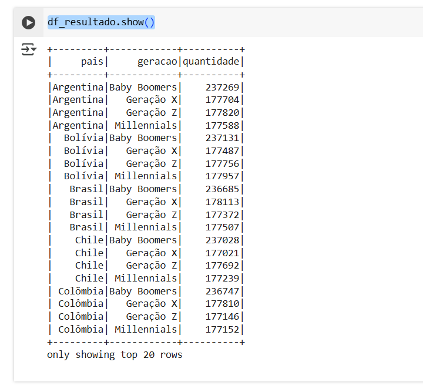

# Resumo
Nesta sprint, eu me aprofundei nos conhecimentos sobre manipulação de dataframes com o framework Apache Spark e dei continuidade 
à aprendizagem sobre Datalake e sua camada trusted na AWS através do desafio. 

# Exercícios

Nesta Sprint, realizei exercícios que exploraram:
1) Gerar dados em massa com Python:

- Acesse [aqui](./Exercicios/massa_de_dados/etapa1.py) o código da etapa 1 do exercício; 

- Acesse [aqui](./Exercicios/massa_de_dados/etapa2.py) o código da etapa 2 do exercício;

- Acesse [aqui](./Exercicios/massa_de_dados/animais.csv) o resultado da etapa 2; 

- Acesse [aqui](./Exercicios/massa_de_dados/etapa3.py) o código da etapa 3 do exercício; 

- Acesse [aqui](./Exercicios/massa_de_dados/nomes.txt) o resultado da etapa 3.

2) Montar um dataframe com Apache Spark:

- Acesse [aqui](./Exercicios/spark/pessoas_pais_geracao.py) o código do laboratório de Spark;

- Resultado do laboratório:

# Desafio

Para acessar o desafio, clique [aqui](Desafio/README.md)

# Evidências

As evidências do desafio podem ser acessadas [aqui](Evidencias/)

# Certificados

Nesta sprint, não foram ofertados cursos da AWS. 