# Apresentação

O objetivo desta entrega é criar uma camada de um data lake em que os dados são usados para a análises e extração de insights.
Para isso, segui as etapas de modelagem e processamento de dados a seguir. 

# MODELAGEM DE DADOS CAMADA REFINED - ETAPA 1

Para iniciar o processamento de dados da camada Refined do Data Lake, elaborei um modelo conceitual da base de dados a partir da minha análise que consiste nas seguintes perguntas:

1 - Qual é a distribuição dos orçamentos dos filmes sobre a Segunda Guerra Mundial ao longo dos anos 2000 a 2020? Como isso se relaciona com as bilheterias?

2 - Por que filmes de guerra com temática da Segunda Guerra Mundial continuam a ser populares mesmo décadas após o fim do conflito?

3 - Quais são os principais fatores que influenciaram no desempenho dos filmes sobre a Segunda Guerra Mundial nas bilheterias?

4 - Quais são as melhores práticas para a produção de um filme sobre a Segunda Guerra Mundial de sucesso comercial?

5 - Quais são as oportunidades para a criação de filmes inovadores que atendam às demandas do público?

Iniciei uma exploração dos dados usando o Athena, exportei as consultas e com uma planilha eletronica separei os campos necessários para o esquema dos elementos construtores com os dados oriundos da camada trusted. Conforme as imagens a seguir.

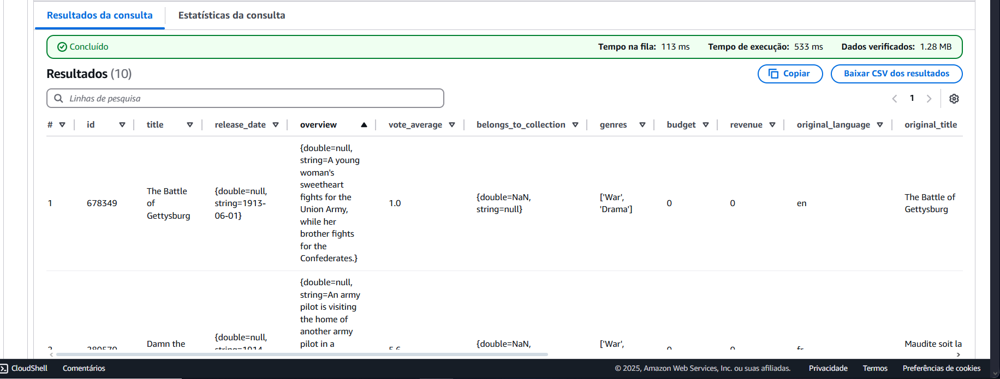

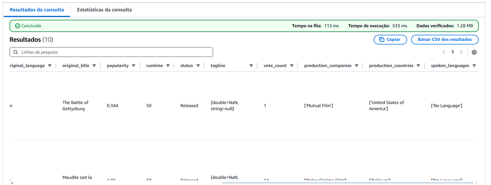

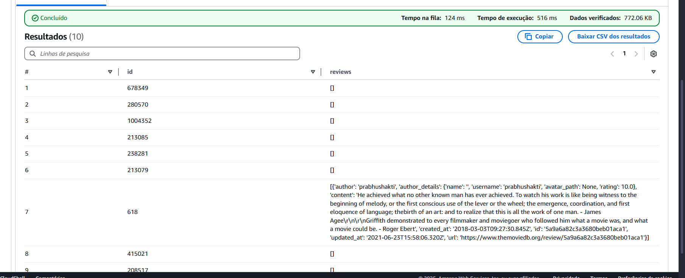

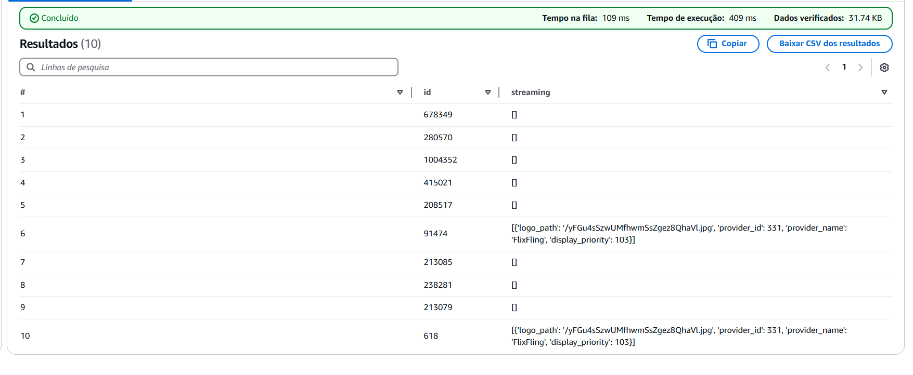

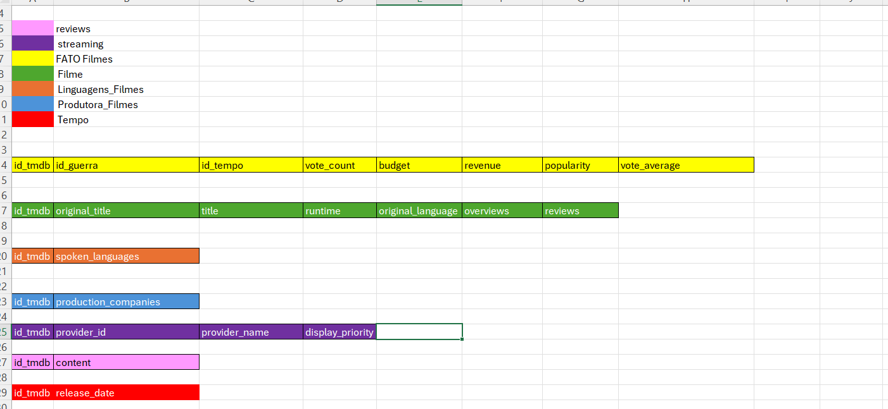

A partir disso, elaborei o modelo conceitual usando a ferramenta Br Modelo. Segue a imagem do modelo. 

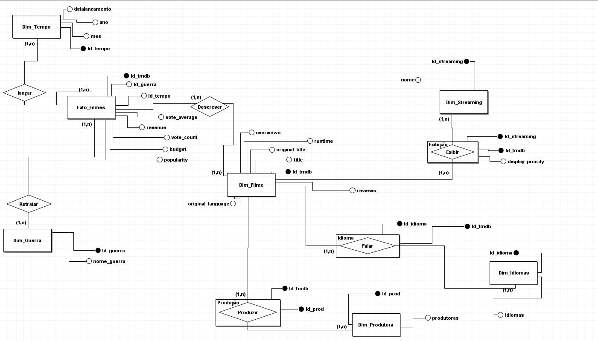

E com isso segui para a próxima etapa.

# PROCESSAMENTO CAMADA REFINE

Como alguns campos eram mutivalorados, além de criar as tabelas das dimensões e tabela fato na camada Refined foi necesário fazer um tratamento dos dados e tabelas associativas para resolver a relação muitos para muitos. As tabelas associativas são formadas por uma chave composta por duas Fks das tabelas que se relacionam e faz com que os valores em cada linha sejam únicos. Além das Fks das tabelas que se relacionam, podem ter campos com características daquela relação.

## Criação das dimensões

Iniciei o processamento criando uma tabela temporária que não fica disponível no catalogo do glue e serve apenas para auxiliar na construção das dimensões filme, tempo, guerras, produtoras e idioma.O código pode ser acessado [aqui](../Desafio/dimensões/dim_filme.py). 

Além desse código, como segui aplicando o pilar da decomposição (como explicado na sprint 8) elaborei mais nove scripts para a criação da modelagem e para não ficar extenso, vou me ater a descrever os elementos de cada um ao invés de reproduzi-los e comentá-los como na úçtima sprint. 

### dim_filme
Voltando ao código da dim_filme: eu inicio ele importando as bibliotecas necessárias para o processamento, definindo as váriáveis necessárias (dois imputs para dados da trusted e dois outputs para salvar no s3 a dim_filme e a tabela temporária), trato os dados que serão utilizados na dim_tempo e os campos overview e review da dim_filme, e excluo campos que não serão usados na análise. 

Depois, como fiz apenas um filtro pelo genero War na reingestão, adiciono o filtro do período da minha análise (2000 e 2020), faço listas com as palavras relacionadas a cada guerra da amostra e as utilizo para filtrar e categorizar os ids dos filmes por tipo de guerra. 

A seguir, leio e crio um dataframe apenas com o conteúdo do arquivo reviews da trusted que será acrescentado como coluna na dim_filme, listas coms os ids de filmes para cada guerra e uma lista que une as quatro guerras. 

Com a lista da amostra de filmes das guerras que eu defini, seleciono apenas as reviews dela para adicionar as demais informações como coluna em um novo dataframe.

Então, finalmente crio a coluna da categoria guerras, começo a classificar os filmes da amostra e concluo o código salvando as tabelas no s3 na refined.

OBS.: Ao conferir os dados, constatei que as palavras utilizadas acabavam misturando os filmes da segunda guerra com a primeira então decidi criar uma categoria de intersecção chamada "Primeira ou Segunda Guerra" para melhorar a classificação dos filmes na próxima sprint antes de iniciar a construção do dashboard. 

### dim_guerras

Este [código](../Desafio/dimensões/dim_guerras.py) cria um dataframe spark a partir de um dicionário com os nomes das guerras e seus ids que serão utilizados para análise e salva no s3 na refined.

### dim_tempo

O [código](../Desafio/dimensões/dim_tempo.py) seleciona as colunas "datalancamento", "ano" e "mes" da tabela não catalogada, tratando-os e ordenando-os para criar um dataframe com um id_tempo corresponte para cada valor unico de "datalancamento" que será salvo no S3 na refined.

### dim_produtoras

A [dim_produtas](../Desafio/dimensões/dim_produtoras.py) trata a coluna "production_companies" dos dados da trusted, tirando caracteres especiais, separando as produtoras de cada filme em colunas e depois identificados os nomes sem repetição para gerar uma lista com as produtoras e associar a uma lista de id_prod para gerar a tabela a partir de um dicionário que será salva no S3 na refined.

### dim_idioma 

A [dim_idioma](../Desafio/dimensões/dim_idioma.py) trata os dados necessários para a análise a partir da coluna "spoken_languages" a partir da camada trusted com pandas para remover caracteres especiais, selecionando os nomes dos idiomas sem repetição, concatenado-os em uma lista única que é associada a um id_idioma em um dicionário que é salvo como dataframe spark no S3 na refined.

### dim_streaming

O [código](../Desafio/dimensões/dim_streaming.py) da dim_streaming trata os dados do arquivo providers da trusted, separando e filtrando apenas as informações que serão utilizadas na análise e com elas criando novas colunas com cada streaming (seu id e display_priority) por filme que são transformadas em dataframes e unidas sem repetições para gerar a dimensão e salvá-la no S3 na refined. 

## Criação da tabela fato 

Esse [código](../Desafio/tabela_fato/fato_filmes.py) cria a tabela fato a partir das colunas "id", "vote_average", "budget", "revenue", "popularity", "vote_count", "id_guerra" da tabela temporária não catalogada através de um join com a dim_tempo que trás o "id_tempo" e salva no S3 na refined. 

## Criação das tabelas associativas 

Para resolver o problema da relação muitos para muitos em alguns campos da descrição dos filmes (que se tornaram dimensões), foi necessário criar três tabelas associativas: [uma](../Desafio/tabelas_associativas/exibicao.py) para conectar dim_filme com dim_stresming, [outra](../Desafio/tabelas_associativas/falar.py) para conectar dim_filme com dim_idioma e a [última](../Desafio/tabelas_associativas/producao.py) para conectar a dim_filme com a dim_produtoras. 

Para criar as associativas foi usado:

- id_tmdb e id_produtoras;

- id_tmdb e id_idioma;

- e id_tmdb, id_streaming e display_priotity. 

Após criadas as tabelas, segui para a próxima etapa.

# MODELAGEM DE DADOS CAMADA REFINED - ETAPA 2

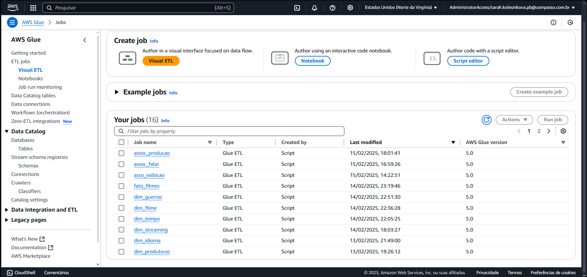

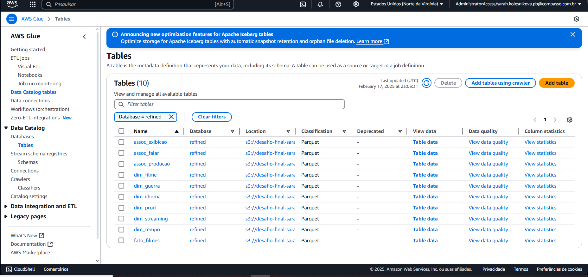

Feitos os jobs no glue, como comprovado nas imagens acima, executei os crawlers para que as tabelas ficassem disponíveis na database "refined" no Athena. 

Podemos ver as tabelas geradas na imagens a seguir. 

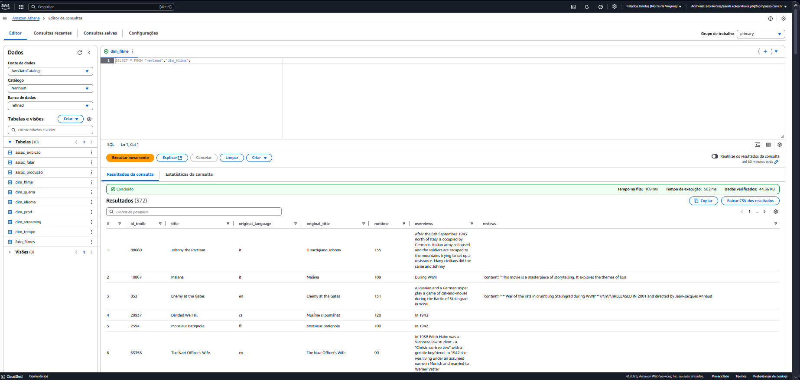

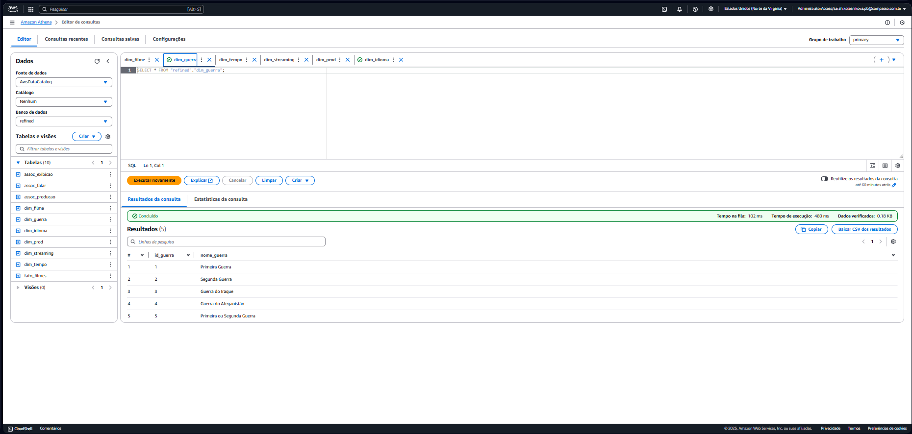

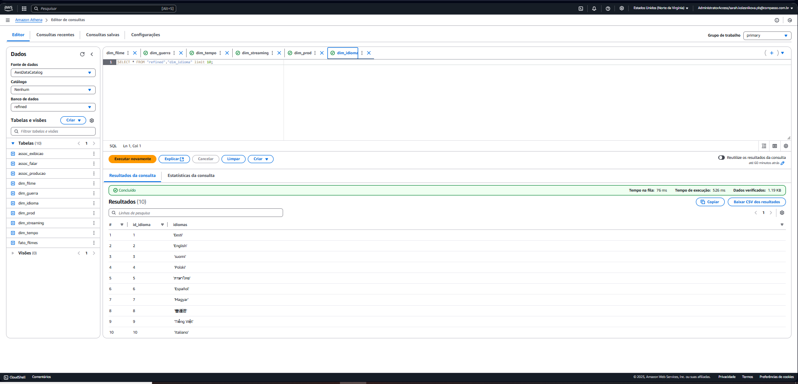

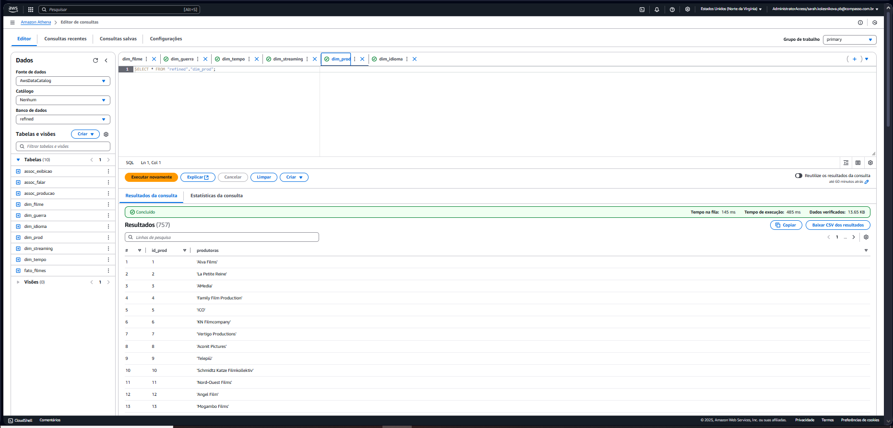

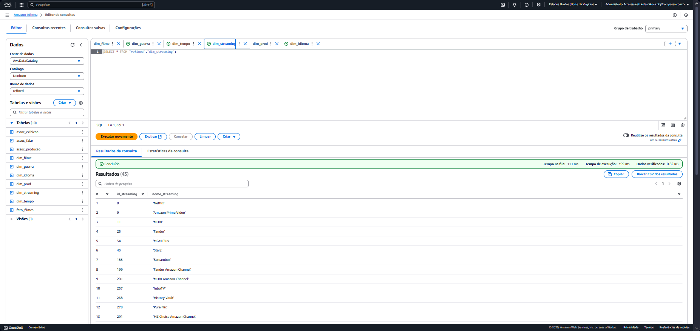

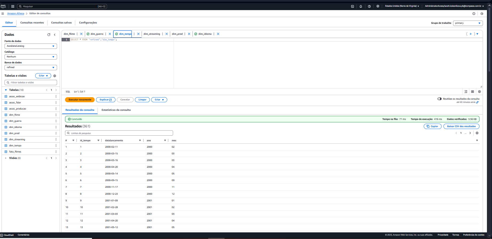

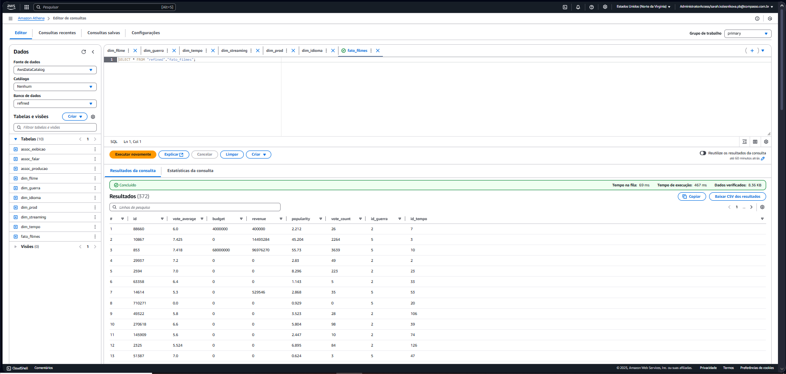

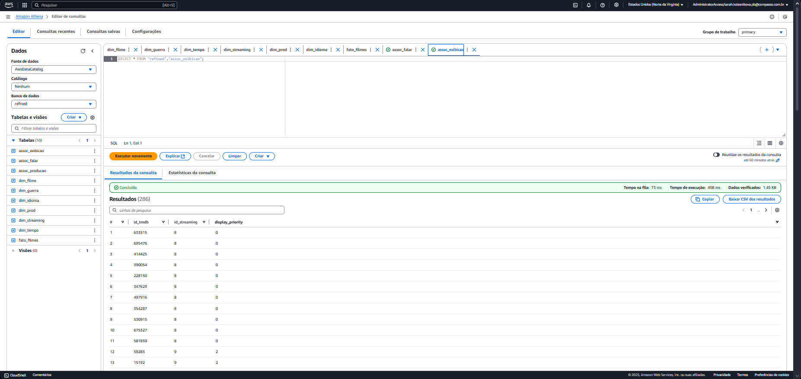

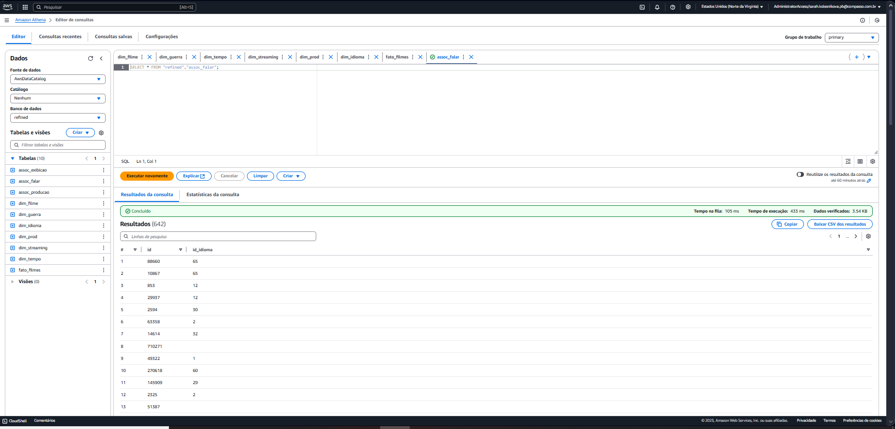

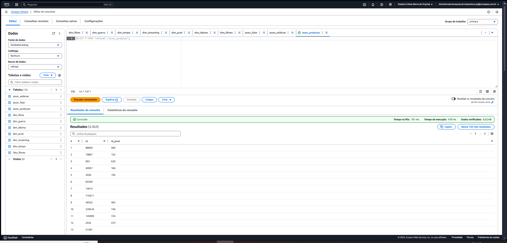

# CONCLUSÃO

Para finalizar, com a ferramenta DBeaver eu criei o diagrama da modelagem dimensional conforme imagem abaixo.

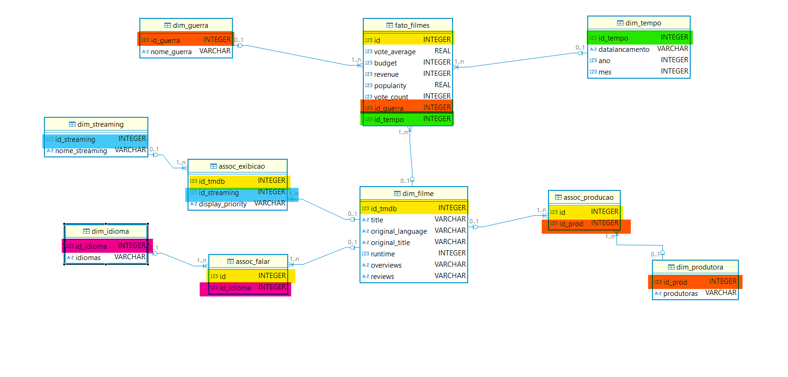

E, com isso, conclui essa entrega do desafio final. 